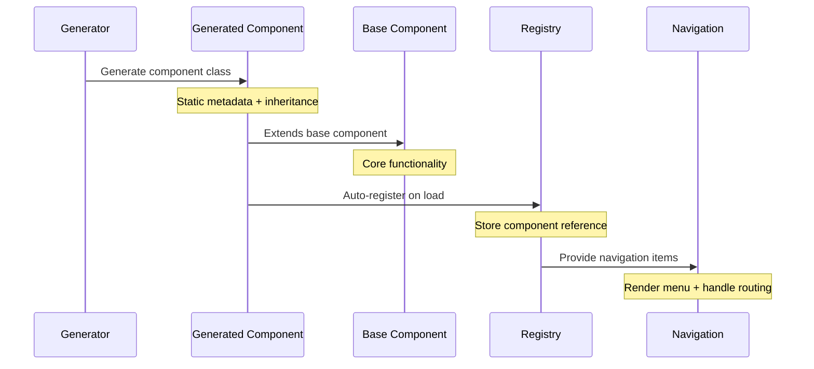

# Component Registration Flow

## Overview
How generated components, base component, and navigation registry work together.

## Registration Flow



## Code Interaction

### 1. Generated Component
```typescript
// Generated by emerge-config-gen
export class AccountSettingsSection extends EmergeConfigSection<AccountConfig> {
    // Static metadata used for navigation
    static metadata: ConfigMetadata = {
        key: 'Account.Settings',
        groupId: 'accounts',
        sectionId: 'settings',
        label: 'Account Settings',
        icon: AccountIcon,
        category: 'Account Management'
    };

    // Auto-registration on module load
    static {
        ConfigSectionRegistry.register(
            AccountSettingsSection.metadata.key,
            AccountSettingsSection
        );
    }
}
```

### 2. Base Component Integration
```typescript
// Base component provides registration hook
export abstract class EmergeConfigSection<T = any> {
    // Static registration method
    static register(key: string, component: typeof EmergeConfigSection): void {
        ConfigSectionRegistry.register(key, component);
    }

    // Required metadata
    static metadata: ConfigMetadata;

    // Navigation helper
    static getNavigationItem(): NavigationItem {
        const meta = this.metadata;
        return {
            id: meta.key,
            title: meta.label,
            path: `/admin/emerge-config/${meta.groupId}/${meta.sectionId}`,
            icon: meta.icon
        };
    }
}
```

### 3. Registry Integration
```typescript
// Central registry for all config sections
export class ConfigSectionRegistry {
    private static sections = new Map<string, typeof EmergeConfigSection>();
    private static navigationItems: NavigationItem[] = [];

    // Registration
    static register(key: string, component: typeof EmergeConfigSection): void {
        this.sections.set(key, component);
        this.updateNavigation();
    }

    // Navigation generation
    private static updateNavigation(): void {
        this.navigationItems = Array.from(this.sections.values())
            .map(section => section.getNavigationItem())
            .sort((a, b) => a.title.localeCompare(b.title));
    }

    // Component lookup
    static getSection(groupId: string, sectionId: string): typeof EmergeConfigSection | undefined {
        return Array.from(this.sections.values())
            .find(section => 
                section.metadata.groupId === groupId && 
                section.metadata.sectionId === sectionId
            );
    }

    // Navigation items for menu
    static getNavigationItems(): NavigationItem[] {
        return this.navigationItems;
    }
}
```

### 4. Navigation Usage
```typescript
// Navigation component uses registry
export const ConfigNavigation: React.FC = () => {
    const items = ConfigSectionRegistry.getNavigationItems();
    
    return (
        <NavigationContent 
            items={items}
            basePath="/admin/emerge-config"
        />
    );
};

// Router component loads sections
export const ConfigRouter: React.FC = () => {
    const { groupId, sectionId } = useParams();
    const Section = ConfigSectionRegistry.getSection(groupId, sectionId);
    
    if (!Section) {
        return <NotFound />;
    }
    
    return <Section />;
};
```

## Key Points

### 1. Auto-Registration
- Components register themselves when loaded
- Uses static initializer block
- No manual registration needed

### 2. Metadata Flow
- Generator creates static metadata
- Base component provides structure
- Registry uses for navigation
- Router uses for loading

### 3. Type Safety
- Generated components are typed
- Registry maintains types
- Navigation items are typed
- Router enforces types

### 4. Lazy Loading
```typescript
// Generated index file
export const sections = {
    'accounts.settings': lazy(() => import('./AccountSettingsSection')),
    'accounts.categories': lazy(() => import('./AccountCategoriesSection'))
};

// Registry enhancement
export class ConfigSectionRegistry {
    static async loadSection(key: string): Promise<typeof EmergeConfigSection> {
        const section = await sections[key]();
        return section.default;
    }
}
```

## Implementation Order

1. **Base Setup**
   - Create base component
   - Setup registry
   - Add navigation components

2. **Generator Enhancement**
   - Add metadata generation
   - Generate registration code
   - Create lazy loading

3. **Integration**
   - Connect registry to navigation
   - Setup routing
   - Add error boundaries

4. **Validation**
   - Test registration flow
   - Verify navigation updates
   - Check lazy loading
   - Test error cases
