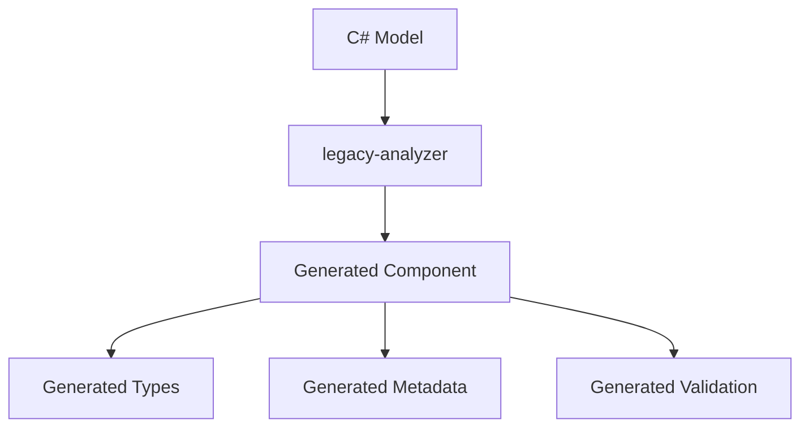
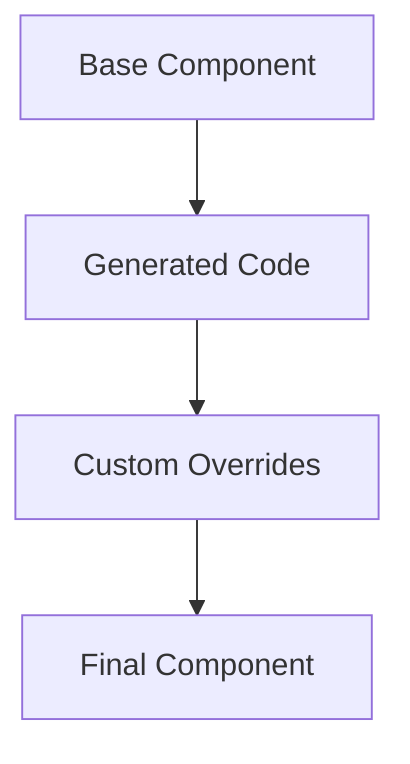

# Emerge Configuration Management System Design

## Overview
This document outlines the design for the Emerge Configuration Management System, focusing on a base component architecture with automated code generation for configuration sections.

## Core Concepts

### 1. Settings Structure
- All settings are stored in a single database table
- Settings follow a key-value pattern with metadata
- Keys are structured as `{SettingGroupName}.{SettingName}`
- Values support multiple data types (boolean, string, number, json)

### 2. Base Component Architecture

#### Core Base Component
Located in `src/components/emerge-config/base/`:
```
base/
├── EmergeConfigSection.tsx    # Base React component
├── types/
│   ├── metadata.ts           # Configuration metadata types
│   ├── validation.ts         # Validation rule types
│   └── layout.ts            # Layout definition types
├── hooks/
│   ├── useSettingValue.ts    # Value management hook
│   └── useValidation.ts      # Validation hook
└── utils/
    ├── schemaUtils.ts        # Schema handling
    └── validationUtils.ts    # Validation helpers
```

#### Base Component Implementation
```typescript
export abstract class EmergeConfigSection<T = any> extends React.Component<ConfigSectionProps<T>> {
    static metadata: ConfigMetadata;
    
    // Core functionality provided by base
    getValue(): T;
    setValue(value: T): void;
    validate(): ValidationResult;
    getLayout(): LayoutDefinition;
    
    // Must be implemented by generated code
    abstract getDefaultValue(): T;
    abstract getValidationRules(): ValidationRules;
}
```

### 3. Service Layer Integration

#### Settings Service Interface
The base component integrates with the settings service:
```typescript
export interface ISettingsService {
    getSettingsGroup(groupName: string): Promise<ApiSuccessResponse<SettingGroup>>;
    getSetting(key: string): Promise<ApiSuccessResponse<Setting>>;
    updateSetting(key: string, value: any): Promise<ApiSuccessResponse<Setting>>;
    validateSetting(key: string, value: any): Promise<ApiSuccessResponse<ValidationResult>>;
}
```

#### Service Integration in Base Component
```typescript
export abstract class EmergeConfigSection<T = any> {
    @inject(ISettingsService)
    protected settingsService: ISettingsService;

    async loadValue(): Promise<void> {
        const response = await this.settingsService.getSetting(this.getSettingKey());
        if (response.success && response.data) {
            this.setValue(response.data.value);
        }
    }

    async saveValue(value: T): Promise<void> {
        await this.settingsService.updateSetting(this.getSettingKey(), value);
    }
}
```

### 4. Input Components
Located in `src/components/emerge-config/base/inputs/`:
```
inputs/
├── BooleanInput/
│   ├── index.tsx
│   └── types.ts
├── StringInput/
│   ├── index.tsx
│   └── validation.ts
├── NumberInput/
│   ├── index.tsx
│   └── constraints.ts
├── ListInput/
│   ├── index.tsx
│   └── itemTypes.ts
└── ObjectInput/
    ├── index.tsx
    └── schema.ts
```

#### Input Component Pattern
```typescript
export interface InputProps<T> {
    value: T;
    onChange: (value: T) => void;
    validation?: ValidationRules;
    disabled?: boolean;
    schema?: JsonSchema;
}

// Example implementation
export const NumberInput: React.FC<InputProps<number>> = ({
    value,
    onChange,
    validation
}) => {
    const handleChange = (e: React.ChangeEvent<HTMLInputElement>) => {
        const newValue = parseFloat(e.target.value);
        if (!isNaN(newValue) && validation?.min <= newValue && newValue <= validation?.max) {
            onChange(newValue);
        }
    };

    return (
        <input
            type="number"
            value={value}
            onChange={handleChange}
            min={validation?.min}
            max={validation?.max}
        />
    );
};
```

### 5. Code Generation

#### Generator Architecture
Enhanced `legacy-analyzer` to generate:
```
emerge-config/
├── generated/
│   ├── Account/
│   │   ├── metadata/
│   │   │   ├── categories.json   # Generated metadata
│   │   │   └── display.json      # Generated metadata
│   │   ├── types/
│   │   │   └── index.ts          # Generated types
│   │   └── sections/
│   │       ├── AccountCategories.tsx  # Generated component
│   │       └── AccountDisplay.tsx     # Generated component
│   └── Transfer/
│       └── ...
└── custom/                        # Manual overrides
    └── Account/
        └── components/
            └── CustomEditor.tsx
```

#### Generated Component Example
```typescript
// Generated code
export class AccountCategoriesSection extends EmergeConfigSection<AccountCategoriesConfig> {
    static metadata: ConfigMetadata = {
        key: 'Account.Categories',
        label: 'Account Categories',
        description: 'Configure account categorization',
        schema: {/*...*/}
    };

    getDefaultValue(): AccountCategoriesConfig {
        return {
            categories: [],
            showInactive: false
        };
    }

    getValidationRules(): ValidationRules {
        return {
            'categories': { required: true, minItems: 1 },
            'showInactive': { type: 'boolean' }
        };
    }
}
```

### 6. Component Customization

#### Override System
```typescript
// Custom implementation
@ConfigSection({
    extends: AccountCategoriesSection,
    customComponents: {
        categoryEditor: CustomCategoryEditor
    }
})
export class CustomAccountCategoriesSection extends AccountCategoriesSection {
    // Override specific methods while keeping base functionality
    getLayout(): LayoutDefinition {
        return {
            type: 'custom',
            component: 'categoryEditor'
        };
    }
}
```

## Implementation Steps

### 1. Base Infrastructure
1. Create EmergeConfigSection base component
2. Implement core hooks and utilities
3. Add validation system
4. Create layout engine

### 2. Code Generation
1. Update legacy-analyzer for metadata extraction
2. Add component generation
3. Generate types and validation
4. Add customization support

### 3. Manual Components
1. Create override system
2. Build custom editors
3. Add layout customization
4. Implement complex validation

## Component Workflow

### 1. Generated Flow


### 2. Runtime Flow


## Development Process

### 1. New Configuration Section
1. Define C# model with attributes
2. Run code generation
3. Add custom components if needed
4. Register in configuration system

### 2. Customization
1. Create override class
2. Implement custom components
3. Override specific methods
4. Register overrides

## Testing Strategy

### 1. Base Component
- Unit tests for core functionality
- Integration tests with service layer
- Validation testing
- Layout testing

### 2. Generated Code
- Snapshot testing
- Type checking
- Schema validation
- Integration testing

### 3. Custom Components
- Component testing
- Override testing
- Integration testing
- Visual testing

## Future Considerations

### 1. Enhanced Type Generation
- Generate more precise TypeScript types
- Add runtime type checking
- Support complex validation patterns
- Add migration helpers

### 2. Advanced Components
- Rich text editor integration
- File upload handling
- Dynamic dependency loading
- Custom validation rules

### 3. Performance Optimizations
- Form field memoization
- Lazy validation
- Batch updates
- State management improvements

### 4. Developer Experience
- Component generation CLI
- Visual layout editor
- Documentation generation
- Testing utilities

### 5. Integration Features
- Cross-section dependencies
- Conditional visibility
- Dynamic validation
- Undo/redo support

## Next Steps
1. Implement base component
2. Update code generation
3. Create first section
4. Add testing framework
5. Document patterns
