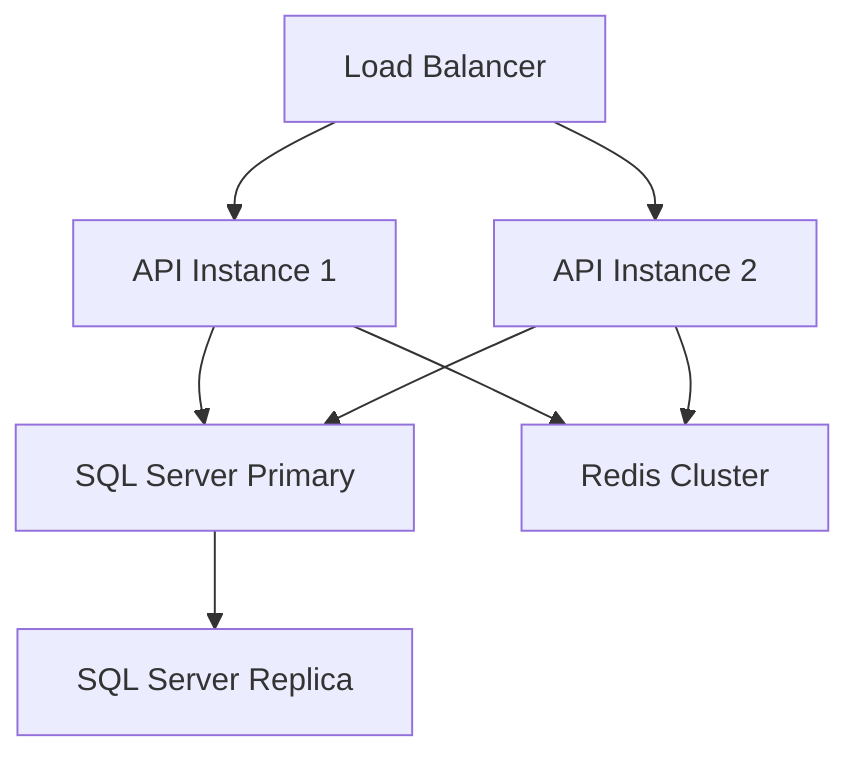

# Deployment Configuration

This document outlines the deployment configuration and procedures for the CBP Config API.

## Environment Configuration

### Configuration Files
```
/config
├── default.json     # Default configuration
├── development.json # Development overrides
├── staging.json    # Staging overrides
└── production.json # Production overrides
```

### Environment Variables
```bash
# Server Configuration
NODE_ENV=production
PORT=3000
HOST=0.0.0.0

# Database Configuration
DB_HOST=localhost
DB_PORT=1433
DB_NAME=cbp_config
DB_USER=app_user
DB_PASSWORD=<secure-password>
DB_POOL_MIN=5
DB_POOL_MAX=10

# Redis Configuration
REDIS_HOST=localhost
REDIS_PORT=6379
REDIS_PASSWORD=<secure-password>

# Security Configuration
JWT_SECRET=<secure-secret>
API_KEY=<secure-api-key>
ENCRYPTION_KEY=<secure-key>

# Logging Configuration
LOG_LEVEL=info
LOG_FORMAT=json

# Monitoring Configuration
METRICS_ENABLED=true
TRACING_ENABLED=true

# Feature Flags
ENABLE_CACHE=true
ENABLE_RATE_LIMIT=true
```

## Deployment Architecture



## Prerequisites

### System Requirements
- Node.js 18.x or higher
- SQL Server 2019 or higher
- Redis 6.x or higher
- Docker 20.x or higher
- Docker Compose 2.x or higher

### Network Requirements
- Inbound ports: 80, 443
- Outbound ports: 1433 (SQL), 6379 (Redis)
- VPC connectivity
- SSL certificates

## Deployment Process

### 1. Build Process
```bash
# Install dependencies
npm ci

# Run tests
npm test

# Build application
npm run build

# Create Docker image
docker build -t cbp-config-api:latest .
```

### 2. Database Migration
```bash
# Run migrations
npm run migrate:up

# Verify migration status
npm run migrate:status

# (If needed) Rollback
npm run migrate:down
```

### 3. Container Deployment
```yaml
# docker-compose.yml
version: '3.8'

services:
  api:
    image: cbp-config-api:latest
    environment:
      - NODE_ENV=production
      - PORT=3000
    ports:
      - "3000:3000"
    depends_on:
      - redis
    healthcheck:
      test: ["CMD", "curl", "-f", "http://localhost:3000/health"]
      interval: 30s
      timeout: 10s
      retries: 3

  redis:
    image: redis:6-alpine
    ports:
      - "6379:6379"
    volumes:
      - redis-data:/data
    command: redis-server --appendonly yes

volumes:
  redis-data:
```

### 4. SSL Configuration
```nginx
# nginx.conf
server {
    listen 443 ssl;
    server_name api.example.com;

    ssl_certificate /etc/nginx/ssl/server.crt;
    ssl_certificate_key /etc/nginx/ssl/server.key;
    
    location / {
        proxy_pass http://api:3000;
        proxy_set_header Host $host;
        proxy_set_header X-Real-IP $remote_addr;
    }
}
```

## Health Checks

### Application Health
```typescript
// health.routes.ts
router.get('/health', async (req, res) => {
  const health = {
    status: 'UP',
    timestamp: new Date(),
    components: {
      database: await checkDatabaseHealth(),
      redis: await checkRedisHealth(),
      api: {
        status: 'UP',
        version: process.env.npm_package_version
      }
    }
  };
  
  res.json(health);
});
```

### Component Health Checks
1. Database Connectivity
2. Redis Connectivity
3. Message Queue Status
4. External Service Status
5. Disk Space
6. Memory Usage

## Monitoring Setup

### Metrics Collection
```typescript
// metrics.ts
const metrics = {
  requestCount: new Counter({
    name: 'http_requests_total',
    help: 'Total HTTP requests'
  }),
  
  responseTime: new Histogram({
    name: 'http_response_time_seconds',
    help: 'HTTP response time in seconds'
  })
};
```

### Log Collection
```typescript
// logger.ts
const logger = winston.createLogger({
  level: process.env.LOG_LEVEL || 'info',
  format: winston.format.json(),
  defaultMeta: { service: 'cbp-config-api' },
  transports: [
    new winston.transports.Console(),
    new winston.transports.File({ filename: 'error.log', level: 'error' }),
    new winston.transports.File({ filename: 'combined.log' })
  ]
});
```

## Backup Procedures

### Database Backup
```bash
# Full backup
BACKUP DATABASE cbp_config 
TO DISK = 'N:\Backups\cbp_config_full.bak'
WITH INIT, NAME = 'CBP Config Full Backup';

# Transaction log backup
BACKUP LOG cbp_config
TO DISK = 'N:\Backups\cbp_config_log.bak';
```

### Configuration Backup
```bash
# Backup environment configuration
cp /etc/cbp-config/* /backup/config/

# Backup SSL certificates
cp /etc/ssl/certs/* /backup/ssl/
```

## Rollback Procedures

### 1. Application Rollback
```bash
# Stop current version
docker-compose down

# Pull previous version
docker pull cbp-config-api:previous

# Update docker-compose.yml
sed -i 's/latest/previous/' docker-compose.yml

# Start previous version
docker-compose up -d
```

### 2. Database Rollback
```sql
-- Revert to previous migration
SELECT migration_name, batch
FROM migrations
ORDER BY id DESC
LIMIT 1;

-- Execute rollback
npm run migrate:down
```

### 3. Configuration Rollback
```bash
# Restore previous configuration
cp /backup/config/* /etc/cbp-config/

# Restart application
docker-compose restart
```

## Security Procedures

### SSL Certificate Renewal
```bash
# Generate CSR
openssl req -new -key server.key -out server.csr

# Install new certificate
cp new_cert.pem /etc/ssl/certs/
cp new_key.pem /etc/ssl/private/

# Reload nginx
nginx -s reload
```

### API Key Rotation
```bash
# Generate new key
NEW_API_KEY=$(openssl rand -base64 32)

# Update configuration
sed -i "s/API_KEY=.*/API_KEY=$NEW_API_KEY/" .env

# Notify clients
curl -X POST http://notification-service/api-key-update
```

## Troubleshooting

### Common Issues
1. Connection Timeouts
   - Check network connectivity
   - Verify firewall rules
   - Check connection pool settings

2. Memory Issues
   - Check container limits
   - Monitor garbage collection
   - Review memory leaks

3. Performance Issues
   - Check database indexes
   - Review query performance
   - Monitor cache hit rates

### Debug Mode
```bash
# Enable debug logging
export LOG_LEVEL=debug

# Start with inspector
node --inspect dist/index.js

# Monitor memory
node --inspect --heap-prof dist/index.js
```

## Maintenance Windows

### Scheduled Maintenance
- Database maintenance: Sundays 2 AM - 4 AM
- Application updates: Sundays 4 AM - 6 AM
- Security patches: As needed with 48h notice

### Notification Procedure
1. Send maintenance notification (48h prior)
2. Send reminder (2h prior)
3. Send start notification
4. Send completion notification
