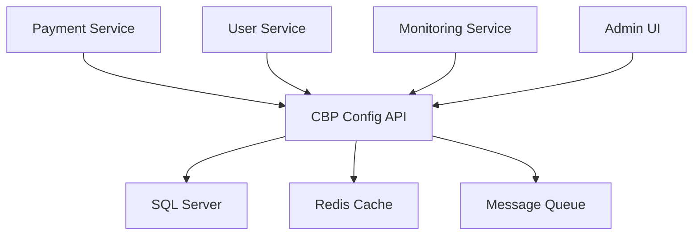

# System Integration Points

This document outlines the integration points between the CBP Config API and other systems, including dependencies, data flow, and event handling.

## System Architecture



## External Dependencies

### 1. SQL Server
- **Purpose**: Primary data store
- **Connection**: Connection pool via mssql
- **Access Pattern**: Read/write with transaction support
- **Health Check**: `/health/database`

### 2. Redis Cache
- **Purpose**: Application-level caching
- **Connection**: Redis client with clustering
- **Access Pattern**: Cache-aside pattern
- **Health Check**: `/health/cache`

### 3. Message Queue
- **Purpose**: Event distribution
- **Connection**: RabbitMQ client
- **Access Pattern**: Publish/Subscribe
- **Health Check**: `/health/queue`

## API Integration Points

### Payment Service Integration
```typescript
interface PaymentServiceIntegration {
  // Webhook endpoint for payment status updates
  POST /webhooks/payment-status
  
  // Payment verification endpoint
  GET /payments/:id/verify
  
  // Payment processing status
  GET /payments/:id/status
}
```

### User Service Integration
```typescript
interface UserServiceIntegration {
  // User authentication verification
  GET /users/verify
  
  // User preferences sync
  POST /users/preferences/sync
  
  // User activity tracking
  POST /users/activity
}
```

### Monitoring Service Integration
```typescript
interface MonitoringIntegration {
  // Metrics reporting
  POST /metrics
  
  // Log aggregation
  POST /logs
  
  // Alert triggers
  POST /alerts
}
```

## Event Handling

### Published Events
1. Payment Events
   ```typescript
   interface PaymentEvent {
     type: 'PAYMENT_CREATED' | 'PAYMENT_UPDATED' | 'PAYMENT_DELETED';
     payload: {
       id: string;
       status: string;
       amount: number;
       timestamp: string;
     }
   }
   ```

2. User Events
   ```typescript
   interface UserEvent {
     type: 'USER_UPDATED' | 'PREFERENCES_UPDATED';
     payload: {
       userId: string;
       changes: Record<string, any>;
       timestamp: string;
     }
   }
   ```

3. System Events
   ```typescript
   interface SystemEvent {
     type: 'CONFIG_UPDATED' | 'SYSTEM_ALERT';
     payload: {
       component: string;
       details: Record<string, any>;
       severity: 'INFO' | 'WARNING' | 'ERROR';
       timestamp: string;
     }
   }
   ```

### Event Publishing Pattern
```typescript
async function publishEvent(event: Event) {
  try {
    await messageQueue.publish('events', JSON.stringify(event));
    logger.info('Event published', { type: event.type });
  } catch (error) {
    logger.error('Event publishing failed', { error });
    // Implement retry logic or store failed events
  }
}
```

## Data Flow

### Inbound Data Flow
1. Client Requests
   - Authentication via Bearer token
   - Rate limiting per client
   - Request validation
   - Request logging

2. Webhook Events
   - Signature verification
   - Event validation
   - Event logging
   - Event processing

3. System Updates
   - Configuration changes
   - System alerts
   - Metrics collection

### Outbound Data Flow
1. Response Data
   - Data transformation
   - Response compression
   - Response caching
   - Error handling

2. Event Publications
   - Event formatting
   - Event routing
   - Delivery confirmation
   - Retry handling

3. Metrics and Logs
   - Metrics aggregation
   - Log formatting
   - Batch processing
   - Storage optimization

## Security Boundaries

### Authentication
```typescript
interface SecurityBoundaries {
  // Token verification
  authentication: {
    type: 'Bearer';
    verification: 'JWT';
    expiration: number;
  };
  
  // API key management
  apiKeys: {
    rotation: 'quarterly';
    storage: 'encrypted';
    distribution: 'secure channel';
  };
  
  // Rate limiting
  rateLimits: {
    window: '15m';
    max: 1000;
    perIp: true;
  };
}
```

### Data Protection
1. In Transit
   - TLS 1.3
   - Certificate rotation
   - Secure headers

2. At Rest
   - Database encryption
   - Backup encryption
   - Key management

3. In Processing
   - Memory protection
   - Secure computation
   - Data masking

## Integration Testing

### Test Environments
1. Development
   - Mock external services
   - Local database
   - In-memory cache

2. Staging
   - Test instances of services
   - Test database
   - Shared cache

3. Production
   - Live services
   - Production database
   - Distributed cache

### Integration Test Pattern
```typescript
describe('Integration Tests', () => {
  it('should handle payment workflow', async () => {
    // Create payment
    const payment = await createPayment();
    
    // Verify webhook received
    await expectWebhook('PAYMENT_CREATED');
    
    // Check payment status
    const status = await getPaymentStatus(payment.id);
    expect(status).toBe('PENDING');
    
    // Process payment
    await processPayment(payment.id);
    
    // Verify completion
    await expectWebhook('PAYMENT_COMPLETED');
  });
});
```

## Monitoring and Alerting

### Key Metrics
1. Integration Health
   - Service availability
   - Response times
   - Error rates
   - Data consistency

2. System Performance
   - Resource utilization
   - Queue depths
   - Cache hit rates
   - Network latency

3. Business Metrics
   - Transaction volume
   - Success rates
   - Processing times
   - User activity

### Alert Configuration
```typescript
interface AlertConfig {
  // Service degradation
  degradation: {
    threshold: '99.9%';
    window: '5m';
    channels: ['slack', 'email'];
  };
  
  // Error spikes
  errors: {
    threshold: '1%';
    window: '1m';
    channels: ['slack', 'pager'];
  };
  
  // System resources
  resources: {
    cpu: '80%';
    memory: '85%';
    disk: '90%';
    channels: ['email', 'dashboard'];
  };
}
```

## Disaster Recovery

### Failover Procedures
1. Database Failover
   - Automatic failover to replica
   - Read-only mode during recovery
   - Data consistency verification

2. Cache Recovery
   - Rebuild from database
   - Gradual warm-up
   - Temporary degraded performance

3. Message Queue Recovery
   - Message persistence
   - Redelivery handling
   - Order preservation

### Recovery Time Objectives
- RTO: 4 hours
- RPO: 15 minutes
- MTTR: 30 minutes
