# Formalized and Structured Transcript

---

## 1. Introduction and Overview
**[0.00s - 9.76s]** Recording started. Discussion begins regarding system theming, noting that it is not being utilized. *(Legacy Tool: Theming was built in OutSystems but never adopted. Originally implemented for visual customization but deemed unnecessary.)*

The legacy dashboard shows the following structure:
- Connect branding in top left
- Left navigation menu with hierarchical sections:
  - Security Manager (with subsections for dashboard, client/user management, and global configuration)
  - Bill Pay
  - Money Desktop
  - Audit
  - Other Tools
- Main content area displays two primary function cards:
  - Security Manager (with shield icon)
  - Bill Pay (with document/pen icon)
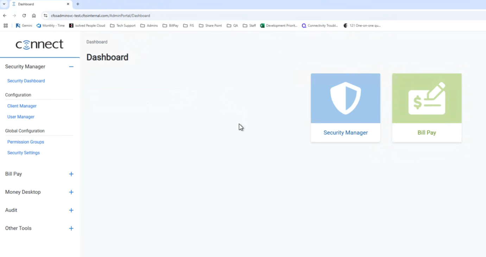

## 2. User Management & Access Control
**[22.12s - 50.62s]**  
- User management includes a drill-down feature for viewing user details.  
- Modular layout present on the left-hand side.  
- Access restricted per credit union: each credit union sees only its data, whereas staff can view all credit unions.  
- Three distinct access levels implemented:
  - Credit union support
  - Manager
  - Connect employee

The Institution Dashboard provides comprehensive user management through:
- Three main tabs: Institution Details, Users, and Permissions Manager
- User management features:
  - Search functionality for filtering users
  - Export capability via "Users Report" button
  - User creation via "Add User" button
  - Sortable user list with columns for:
    - Name
    - Username
    - Email
    - Mobile Phone
    - Active Status
- System feedback through error messaging when issues occur
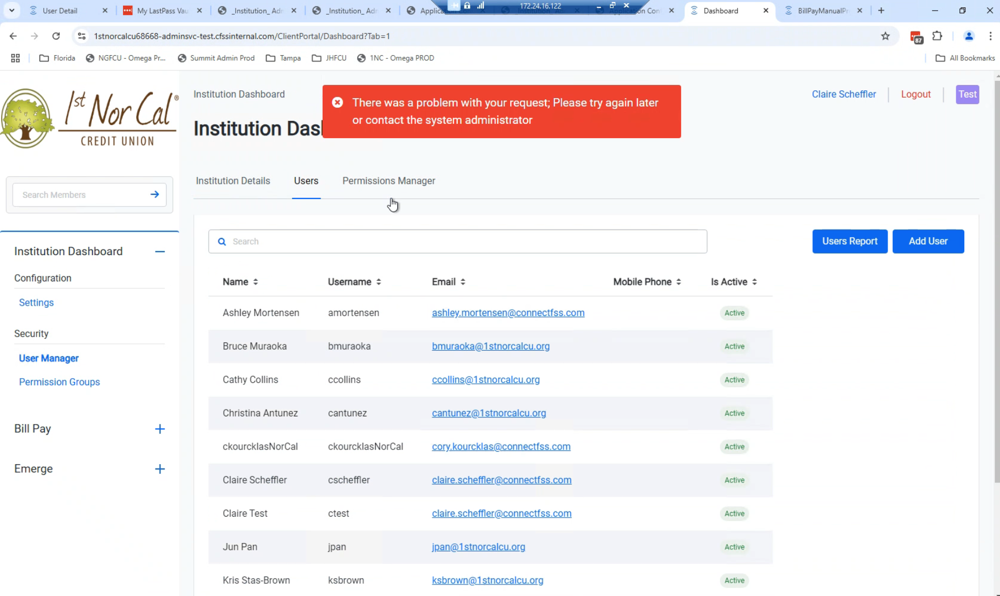

**[50.62s - 89.88s]** *(New Admin Tool: Planned UI improvements for user management.)*  
- Navigation to user management from First Norcal's screen.  
- Four primary tabs: Details, User Management, Features, Security.  
- Clicking on a user allows access to user management functions, including permission settings.  

The Institution Details tab provides branding and basic configuration:
- Client Details section for visual customization:
  - Client logo upload and display
  - Primary color selection (e.g., "transparent")
  - Secondary color selection (e.g., "neutral-1")


## 3. Security & Authentication
**[89.88s - 126.36s]** *(New Admin Tool: Security enhancements and 2FA enforcement.)*  
- Security settings include options for password resets and two-factor authentication (2FA).  
- 2FA supported via Microsoft Authenticator (time-based one-time passwords).  
- Configuration of 2FA setup is possible through institution-level toggle.
- Institution administrators can enforce 2FA for all users.
- **Security Concern:** Some configuration passwords stored in clear text, needs addressing.


## 4. Feature Management
**[195.54s - 315.84s]** *(New Admin Tool: Feature toggling improvements.)*  
- Overview of feature toggling within the system.  
- Clients can enable specific features such as:  
  - Connect Bill Pay  
  - Data Integrity Check  
  - Online Banking Symmetry  
  - Online Banking Emerge  
  - Money Desktop  
- Feature configuration requires service wake-up for auto-population
- Configuration data pulled directly from database

## 5. Client URLs and Usage
**[406.04s - 423.92s]** *(Legacy Tool: Client URLs designed but never actively used.)*  
- URL-based tenant determination system:
  - Admin portal: `cfsadminsvvc.cfsinternal.com/AdminPortal/Login`
  - Client portal: `1stnorcalcu65668.adminsvvc.test.cfsinternal.com/ClientPortal/Login`
  - Test environment URLs follow specific tenant pattern
  - Production URLs use different domain structure
- Hostname determines tenant (us vs. them)
- Separate portals maintain clear separation of concerns:
  - Client portal for credit union staff access
  - Admin portal for Connect/Fintilect staff access


## 6. User Manager
**[423.92s - 501.72s]** *(Legacy Tool: Security manager not accessible to clients.)*  
- Displays a full list of users without client-specific filtering.  
- Clients do not have access to the security manager.  
- Future consideration: Could implement filtered view instead of hiding entirely

## 7. Permission Groups
**[536.12s - 656.22s]** *(New Admin Tool: Improved role management.)*  
- Groups define user permissions.  
- Super users have full access.  
- Ability to edit groups, view roles, and activate/deactivate roles.  
- Copy roles functionality available but rarely used
- Consideration: Could be simplified to read-only as changes are infrequent

## 8. Security Settings
**[796.80s - 886.16s]** *(New Admin Tool: Enforcement of 2FA at the global level.)*  
- Review of security settings, including the global enforcement of 2FA.  
- Users have a dedicated section to configure authentication methods.  
- Three-level access control implementation:
  - Credit union support
  - Credit union manager
  - Connect/Fintilect employee

## 9. Bill Pay Module
**[895.52s - 1011.76s]** *(Legacy Tool: Current bill pay contact management system.)*  
- Contact information management for each credit union, including:  
  - Sponsor details and prefix
    - Sponsor Prefix (e.g., "068")
    - Sponsor Name
    - Sponsor ID (e.g., "1800003943")
  - Settlement information
    - Routing Number
    - Settlement GL Code
    - Settlement External ACH Number
  - Operating hours
    - Primary business hours (e.g., "10am-5pm PST")
    - After hours contact person and phone
  - Staff contact list with roles and contact information
    - Name, Title, Phone, and Email fields
    - Support for multiple staff members
    - Ability to add new contacts via "Add Bill Pay Contact" button
  - Notes section for additional information
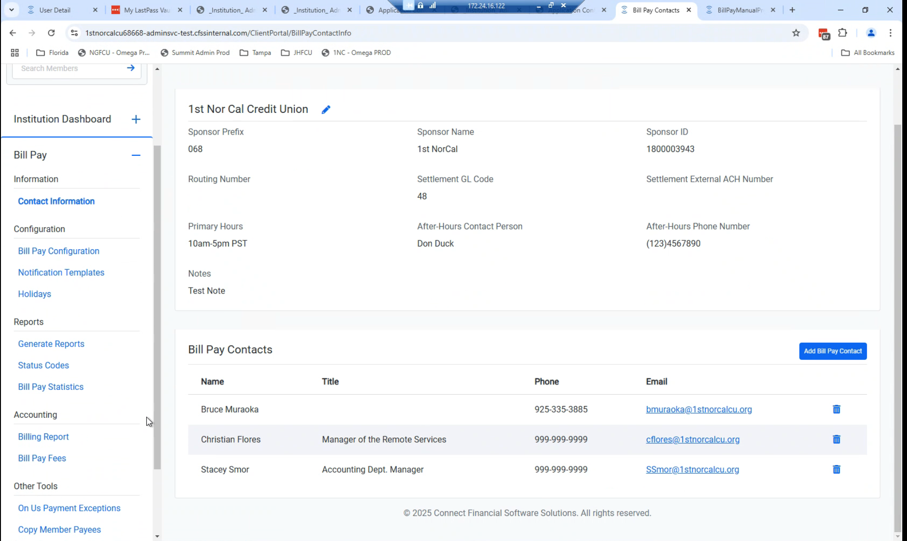

- Manual bill pay run functionality:
  - Pending payment management interface:
    - Access via Bill Pay > Other Tools > Manage Pending Payments
    - Search criteria options:
      - Select Date or Date Range
      - Member ID
      - Payment ID
    - Payment detail views:
      - Single Payment Example:
        - Member ID: 900104801
        - Payment ID: 169C00134055
        - Payee: Wells Fargo (Global Payee)
        - Amount: $975.00
        - Process Date: 07/20/2022
        - Payment Type: Electronic
        - Actions: Cancel Payment, Edit Payment
      - Recurring Payment Example:
        - Member ID: 900144361
        - Payment ID: 169C00199992
        - Payee: Life Insurance (Global Payee)
        - Amount: $40.00
        - Process Date: 07/22/2022
        - Frequency: Quarterly
        - Payments Processed: 14
        - Status: Indefinite
        - Actions: Cancel Series, Edit Series
    - Edit capabilities:
      - Required fields marked with asterisk (*)
      - Modifiable fields:
        - Will Process Date: Date selection
        - Amount: Payment amount in dollars
        - Funding Account: Account number with suffix
      - Changes confirmed via Submit button
    - Important considerations:
      - Cancellations cannot be undone
      - Series cancellation affects all future payments
      - Changes require confirmation
      - Safety features:
        - Single payment cancellation requires explicit confirmation
        - Recurring series shows additional warning about future payments
        - Clear, user-friendly confirmation messages
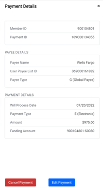
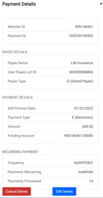
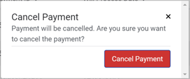
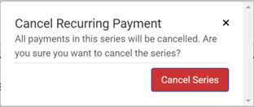
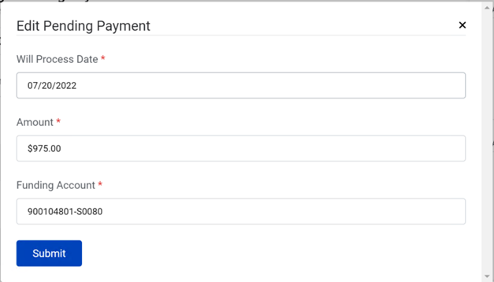

  - Usage analytics and reporting:
    - Global Payment Activity monitoring:
      - Advanced filtering options:
        - Date range selection
        - Client filtering
        - Payment ID search
        - FIS Payee ID lookup
        - Member ID filtering
        - Status code filtering
      - Comprehensive payment tracking system
    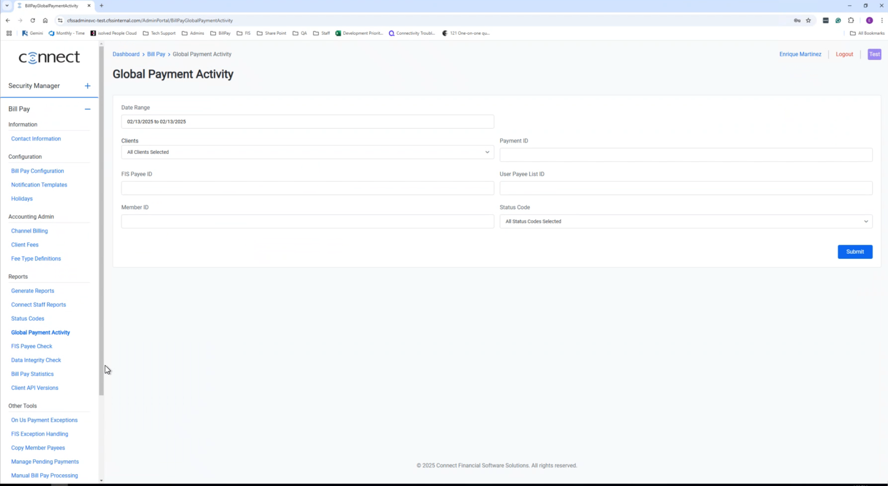

  - Usage Statistics dashboard:
    - Time-based view options:
      - Years
      - Months
      - Days
    - Key metrics tracking:
      - New enrollments (e.g., 65 in 2025)
      - Active users comparison (e.g., 389 vs 1,793)
      - Payment amounts
      - Payment count (e.g., 35,965)
    - Year-over-year comparison capabilities
    - Multi-year trend analysis
  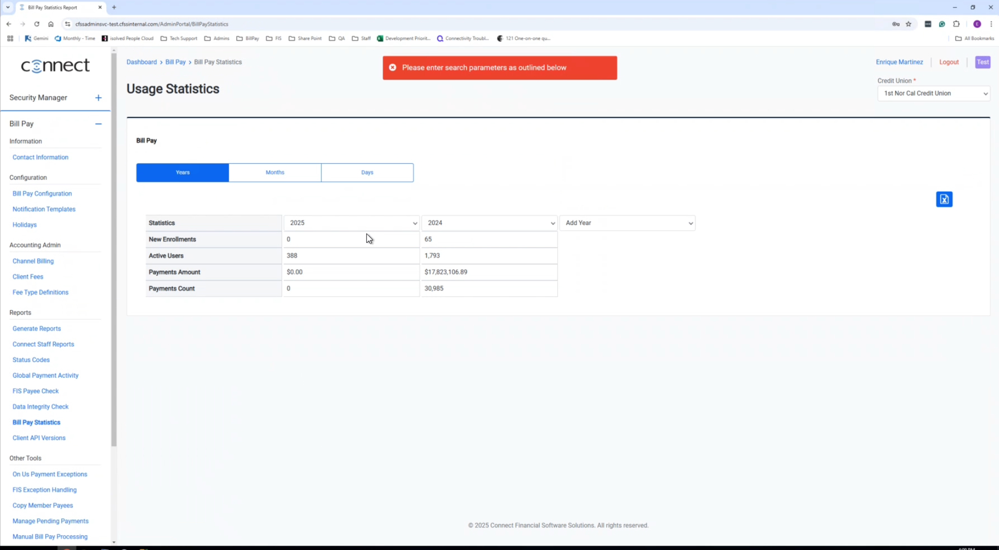

- Status code management:
  - Comprehensive status tracking system with codes including:
    - 100: Pending transactions
    - 101/102: Successfully processed payments (sent to processor/payee)
    - 103: Cancelled transactions
    - 104: In-process payments
    - 105: Awaiting responses
    - 106: Connectivity-related issues
  - User-friendly status descriptions
  - Mapping between internal codes and host system codes
  - Customizable column preferences
  - Pagination support for large datasets
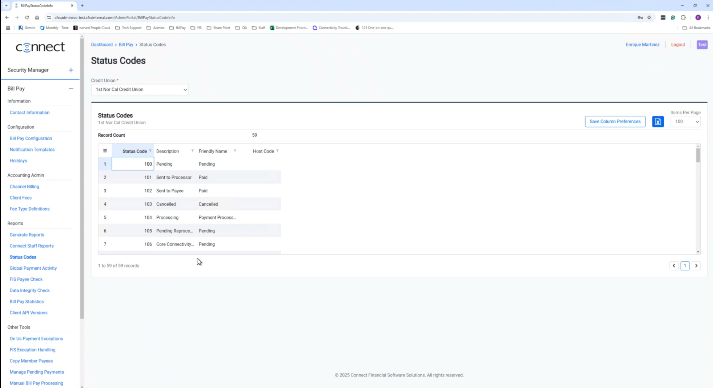

- FIS integration through Customer Service Tool:
  - Secure login portal for FIS operations:
    - Dedicated bill payment support interface
    - Protected access via User ID and Password
    - Version-controlled system (Release 24.04.05)
    - Protected by copyright and confidentiality agreements
  - Payee verification system:
    - Form-based validation of payee details
    - Required fields include:
      - Payee name and account number
      - Complete mailing address
    - Review process to ensure accurate payee information
    - Integration with FIS verification services
  - Global payment activity monitoring
  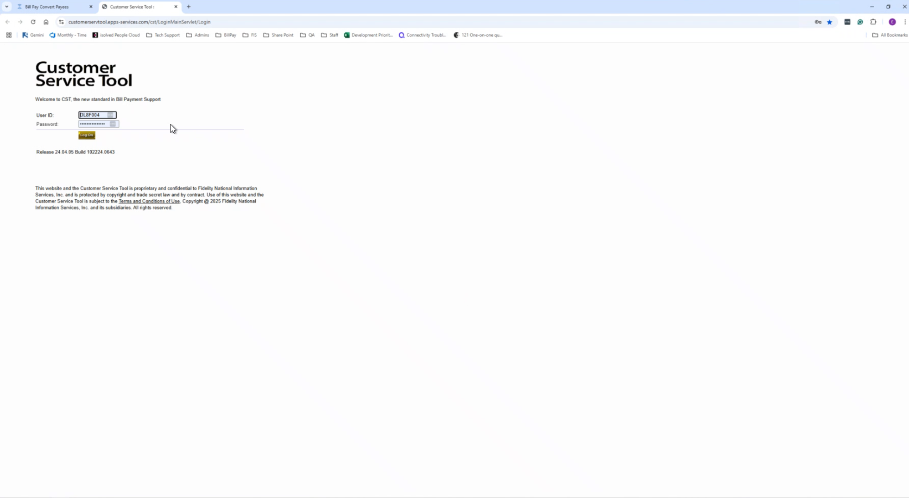
  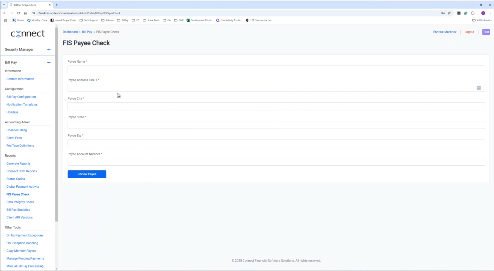

## 10. Notifications & Reports
**[1316.16s - 1452.96s]** *(New Admin Tool: Structured report generation using stored procedures.)*  
- Notification templates categorized as:  
  - Sent to members  
  - Sent to credit union support  
  - Sent to internal teams  
- Reports implemented as stored procedures
- Calendar picker UI for date selection
- Search fields available for filtering

## 11. Known Issues and Deprecated Features
*(Legacy Tool: Features that are broken or no longer needed)*
- On-us payment exceptions: Contains unfixed bugs
- FIS exception handling: Currently broken and unusable
- Data integrity checks: No longer required
- Client API version checking: Not needed in new implementation
- Theming: Built but never adopted

## 12. Account Management & Recovery Tools
**[1452.96s - 1600.00s]** *(Legacy Tool: Account recovery and maintenance utilities)*
- Copy Member Payees utility:
  - Purpose: Transfer payee records between member accounts
  - Primary use case: Account recovery after fraud or other issues requiring account closure
  - Process:
    - Select source and destination accounts within same institution
    - System copies all active payees to new account
    - All existing and pending payments are cancelled as safety measure
  - Important restrictions:
    - Does not automatically enroll new account in Bill Pay
    - User must accept Bill Pay disclosure on new account before accessing copied records
  - Error handling includes connection timeout notifications
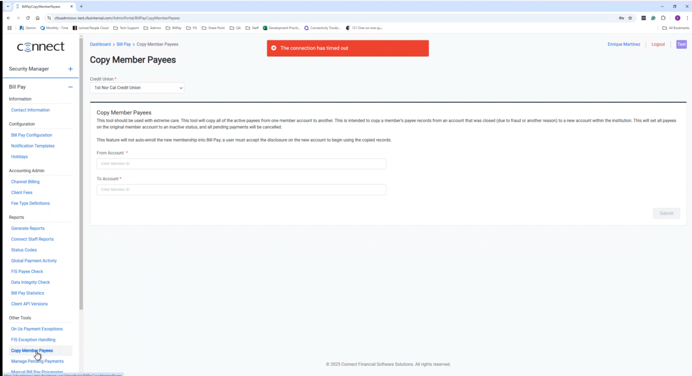

- **Copy Member Payees:**  
  - Used for account reassignment.  
  - Simple process: enter "From" and "To" accounts, confirm, and execute.  
  - No preview of records before transfer.  
  - Immediate execution with completion confirmation.
- **Manage Payees:**
  - Only accessible through client portal
  - Used for managing pending payments for closed accounts

## 13. Testing & Deployment Strategy
**[2944.56s - 3014.00s]** *(New Admin Tool: Parallel deployment strategy.)*  
- System does not process payments but interacts with the database and FIS APIs.  
- Testing Phase:
  - Three-week timeline allocated
  - Five clients identified for testing
  - Ashley available to assist with testing
- Deployment Strategy:
  - Side-by-side deployment with different URL
  - Allows client familiarization before cutover
  - Final cutover: redirect existing URLs to new tool
  - Less critical than previous bill pay migration (no payment processing changes)
  - Client documentation: Updated screenshots needed

## Technical Implementation Notes

### Database & API Integration
- Reports implemented as stored procedures
- Direct API calls to FIS for certain features
- Security concern: Clear text passwords in configuration
- Database access credentials and server information required

### Access Control Implementation
- URL-based tenant determination
- Separate portals:
  - Admin portal (`/admin-portal/login`)
  - Client portal (`/client-portal/login`)
- Three-tier access system

### Custom Configurations
- Holiday settings:
  - Federal holidays (all clients, read-only)
  - Custom holidays (per credit union)
- Feature toggles per client
- Client-specific portal access

This Markdown file will be updated with new screenshots. To convert this document to Word (.docx) using Pandoc, use the command:

```
pandoc legacy_admin_tool.md -o legacy_admin_tool.docx --resource-path=screenshots
```

Make sure that the `screenshots/` folder exists in the same directory as the Markdown file and contains the referenced images.
