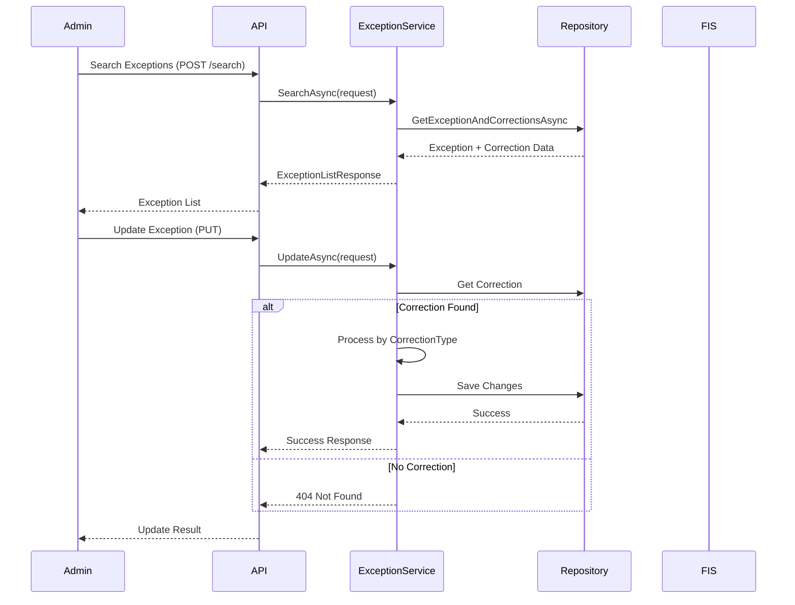
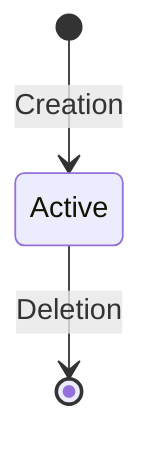
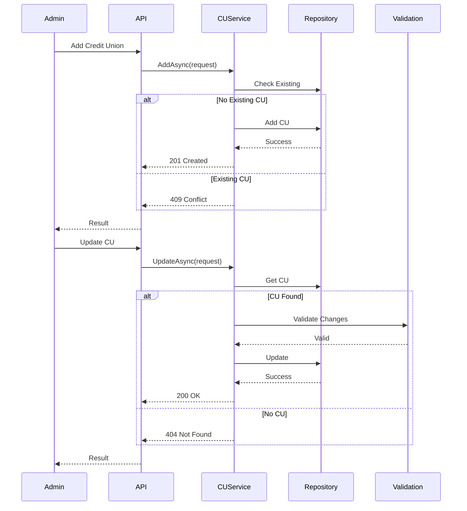
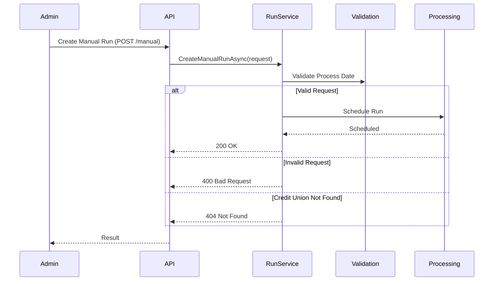
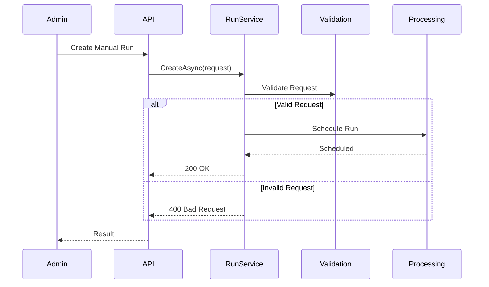
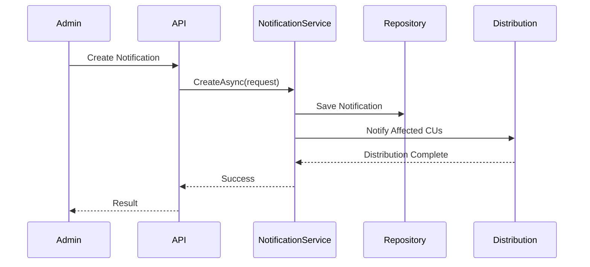
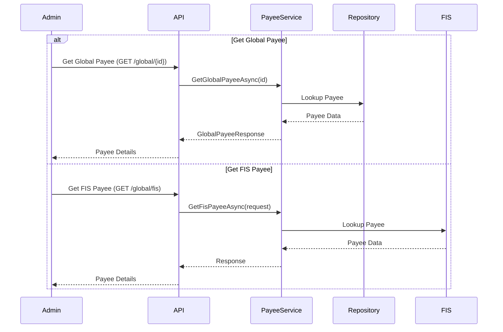
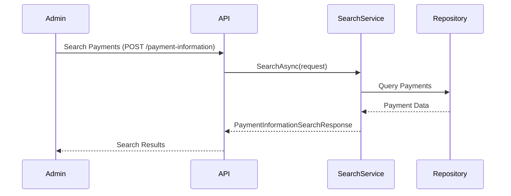
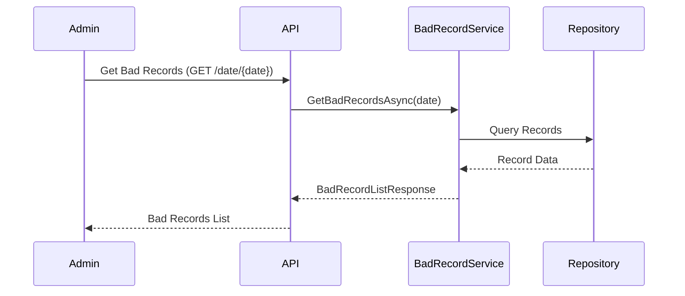
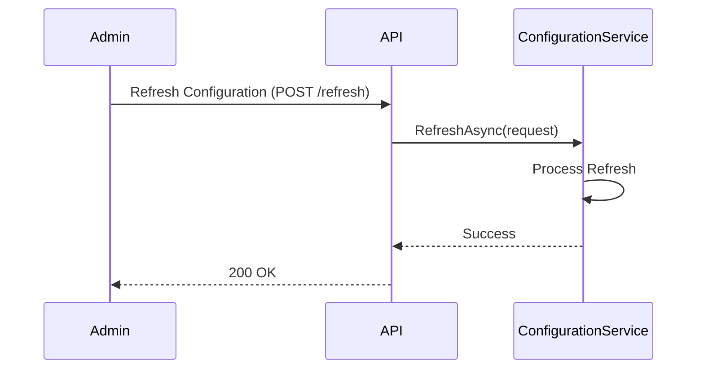

# CBP Admin API Process Flows

## Overview

This document outlines the key administrative workflows and process flows within the CBP Admin API.

## Exception Management Workflow

### Exception Processing Flow



### Exception Management API
```yaml
exception_workflow:
  name: "Exception Management"
  actors: ["Admin"]
  verified_date: "2025-01-03T13:35:20-07:00"
  evidence:
    implementation: 
      - "ExceptionController"
      - "ExceptionService"
    endpoints:
      - "POST /api/v1/exception/search"
      - "PUT /api/v1/exception"
  
  workflows:
    search_exceptions:
      endpoint: "POST /api/v1/exception/search"
      inputs:
        - "Search parameters"
      validation:
        - "Valid search criteria"
      outputs:
        - "ExceptionListResponse"
        - "Exception details"
        - "Correction information"
    
    update_exception:
      endpoint: "PUT /api/v1/exception"
      inputs:
        - "Exception update details"
      validation:
        - "Exception exists"
        - "Valid correction type"
      actions:
        - "Process correction"
        - "Update records"
      responses:
        success: "200 OK"
        not_found: "404 Not Found"
        error: "500 Internal Server Error"
```

### Exception Correction Types

```yaml
correction_types:
  AccountNumber:
    steps:
      1. Validate new account number
      2. Update correction record
      3. Mark for reprocessing
  
  Manual:
    steps:
      1. Record manual resolution
      2. Update status
      3. Close exception
  
  MemberRefunded:
    steps:
      1. Record refund details
      2. Update payment status
      3. Close exception
  
  FisPayeeId:
    steps:
      1. Validate FIS payee
      2. Update payee mapping
      3. Mark for reprocessing
```

## Credit Union Management

### Credit Union API
```yaml
credit_union_workflow:
  name: "Credit Union Management"
  actors: ["Admin"]
  verified_date: "2025-01-03T13:35:20-07:00"
  evidence:
    implementation: 
      - "CreditUnionController"
      - "CreditUnionService"
    endpoints:
      - "GET /api/v1/creditunion/{sponsorId}"
      - "GET /api/v1/creditunion/all"
      - "POST /api/v1/creditunion"
      - "PUT /api/v1/creditunion"
      - "DELETE /api/v1/creditunion/{sponsorId}"
  
  workflows:
    get_credit_union:
      endpoint: "GET /api/v1/creditunion/{sponsorId}"
      inputs:
        - "Sponsor ID"
      validation:
        - "Valid sponsor ID"
      outputs:
        - "CreditUnionResponse"
      responses:
        success: "200 OK"
        not_found: "404 Not Found"
        error: "500 Internal Server Error"
    
    list_credit_unions:
      endpoint: "GET /api/v1/creditunion/all"
      outputs:
        - "CreditUnionListResponse"
      responses:
        success: "200 OK"
        error: "500 Internal Server Error"
    
    add_credit_union:
      endpoint: "POST /api/v1/creditunion"
      inputs:
        - "Credit union details"
      validation:
        - "Valid request"
        - "No existing credit union"
      responses:
        success: "201 Created"
        invalid: "400 Bad Request"
        conflict: "409 Conflict"
        error: "500 Internal Server Error"
    
    edit_credit_union:
      endpoint: "PUT /api/v1/creditunion"
      inputs:
        - "Updated credit union details"
      validation:
        - "Valid request"
        - "Credit union exists"
      responses:
        success: "200 OK"
        invalid: "400 Bad Request"
        not_found: "404 Not Found"
        error: "500 Internal Server Error"
    
    delete_credit_union:
      endpoint: "DELETE /api/v1/creditunion/{sponsorId}"
      inputs:
        - "Sponsor ID"
      validation:
        - "Credit union exists"
      responses:
        success: "200 OK"
        invalid: "400 Bad Request"
        not_found: "404 Not Found"
        error: "500 Internal Server Error"
```

### Credit Union Lifecycle



### Credit Union Operations Flow



## Run Management

### Manual Run API
```yaml
run_workflow:
  name: "Manual Run Management"
  actors: ["Admin"]
  verified_date: "2025-01-03T13:35:20-07:00"
  evidence:
    implementation: 
      - "RunController"
      - "RunService"
    endpoints:
      - "POST /api/v1/run/manual"
  
  workflows:
    create_manual_run:
      endpoint: "POST /api/v1/run/manual"
      inputs:
        - "Process date"
        - "Credit union details"
      validation:
        - "Valid process date"
        - "Credit union exists"
      responses:
        success: "200 OK"
        invalid: "400 Bad Request"
        not_found: "404 Not Found"
        error: "500 Internal Server Error"
```

### Manual Run Flow



## Manual Run Processing

### Manual Run Flow



### Manual Run States

```yaml
manual_run_states:
  states:
    - Scheduled
    - InProgress
    - Completed
    - Failed
    - Cancelled
  
  transitions:
    Scheduled:
      - to: InProgress
        trigger: "processor_pickup"
      - to: Cancelled
        trigger: "admin_cancel"
    
    InProgress:
      - to: Completed
        trigger: "processing_complete"
      - to: Failed
        trigger: "processing_error"
```

## Support Notification Management

### Notification Flow



### Notification States

```yaml
notification_states:
  states:
    - Draft
    - Active
    - Expired
    - Cancelled
  
  transitions:
    Draft:
      - to: Active
        trigger: "activation"
      - to: Cancelled
        trigger: "cancellation"
    
    Active:
      - to: Expired
        trigger: "expiration_time"
      - to: Cancelled
        trigger: "cancellation"
```

## Payee Management

### Payee API
```yaml
payee_workflow:
  name: "Payee Management"
  actors: ["Admin"]
  verified_date: "2025-01-03T13:35:20-07:00"
  evidence:
    implementation: 
      - "PayeeController"
      - "PayeeService"
    endpoints:
      - "GET /api/v1/payee/global/{internalPayeeId}"
      - "GET /api/v1/payee/global/fis"
  
  workflows:
    get_global_payee:
      endpoint: "GET /api/v1/payee/global/{internalPayeeId}"
      inputs:
        - "Internal Payee ID"
      validation:
        - "Valid payee ID"
      outputs:
        - "GlobalPayeeResponse"
      responses:
        success: "200 OK"
        invalid: "400 Bad Request"
        not_found: "404 Not Found"
        error: "500 Internal Server Error"
    
    get_fis_payee:
      endpoint: "GET /api/v1/payee/global/fis"
      inputs:
        - "Name"
        - "Address1"
        - "City"
        - "State"
        - "PostalCode"
        - "UsersAccountAtPayee"
      validation:
        - "Valid payee details"
      responses:
        success: "200 OK"
        invalid: "400 Bad Request"
        not_found: "404 Not Found"
        error: "500 Internal Server Error"
```

### Payee Integration Flow



## Search Management

### Search API
```yaml
search_workflow:
  name: "Payment Search"
  actors: ["Admin"]
  verified_date: "2025-01-03T13:35:20-07:00"
  evidence:
    implementation: 
      - "SearchController"
      - "SearchService"
    endpoints:
      - "POST /api/v1/search/payment-information"
  
  workflows:
    search_payments:
      endpoint: "POST /api/v1/search/payment-information"
      inputs:
        - "Search parameters"
      validation:
        - "Valid search criteria"
      outputs:
        - "PaymentInformationSearchResponse"
      responses:
        success: "200 OK"
        error: "500 Internal Server Error"
```

### Search Flow



## Bad Record Management

### Bad Record API
```yaml
bad_record_workflow:
  name: "Bad Record Management"
  actors: ["Admin"]
  verified_date: "2025-01-03T13:35:20-07:00"
  evidence:
    implementation: 
      - "BadRecordController"
      - "BadRecordService"
    endpoints:
      - "GET /api/v1/badrecord/date/{date}"
  
  workflows:
    get_bad_records:
      endpoint: "GET /api/v1/badrecord/date/{date}"
      inputs:
        - "Search date"
      outputs:
        - "BadRecordListResponse"
      responses:
        success: "200 OK"
        error: "500 Internal Server Error"
```

### Bad Record Flow



## Configuration Management

### Configuration API
```yaml
configuration_workflow:
  name: "Configuration Management"
  actors: ["Admin"]
  verified_date: "2025-01-03T13:35:20-07:00"
  evidence:
    implementation: 
      - "ConfigurationController"
      - "ConfigurationService"
    endpoints:
      - "POST /api/v1/configuration/refresh"
  
  workflows:
    refresh_configuration:
      endpoint: "POST /api/v1/configuration/refresh"
      inputs:
        - "Refresh parameters"
      responses:
        success: "200 OK"
        error: "500 Internal Server Error"
```

### Configuration Flow



## Integration Patterns

### Repository Pattern
```yaml
repository_pattern:
  description: "Data access abstraction using repository pattern"
  repositories:
    - PaymentExceptionRepository
    - CreditUnionRepository
    - FisExceptionsCorrectionRepository
    - BadRecordRepository
    - PaymentInformationRepository
  interfaces:
    - IWarehouseGenericRepository<T>
```

### Service Pattern
```yaml
service_pattern:
  description: "Business logic encapsulation using service pattern"
  services:
    - ExceptionService
    - CreditUnionService
    - RunService
    - PayeeService
    - SearchService
    - BadRecordService
    - ConfigurationService
  interfaces:
    - IExceptionService
    - ICreditUnionService
    - IRunService
    - IPayeeService
    - ISearchService
    - IBadRecordService
    - IConfigurationService
```

### Response Pattern
```yaml
response_pattern:
  description: "Standardized API response handling"
  types:
    - ServiceResponse<T>
    - ExceptionListResponse
    - CreditUnionResponse
    - CreditUnionListResponse
    - GlobalPayeeResponse
    - PaymentInformationSearchResponse
    - BadRecordListResponse
```

### File Structure
```yaml
file_structure:
  controllers:
    - ExceptionController
    - CreditUnionController
    - RunController
    - PayeeController
    - SearchController
    - BadRecordController
    - ConfigurationController
  services:
    - ExceptionService
    - CreditUnionService
    - RunService
    - PayeeService
    - SearchService
    - BadRecordService
    - ConfigurationService
  repositories:
    - PaymentExceptionRepository
    - CreditUnionRepository
    - FisExceptionsCorrectionRepository
    - BadRecordRepository
    - PaymentInformationRepository
```

## References

- API Specification: `admin-api.json`
- Service Implementations:
  - `ExceptionService.cs`
  - `CreditUnionService.cs`
  - `PayeeService.cs`
