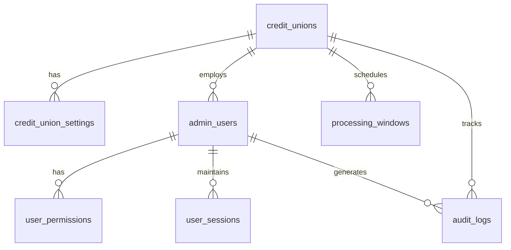

# CBP Admin CU API Database Schema

## Overview

This document defines the database schema and relationships for the Credit Union Administrative API.

## Schema Definition

### Core Schema

```sql
-- Credit Union table
CREATE TABLE credit_unions (
    sponsor_id VARCHAR(50) PRIMARY KEY,
    name VARCHAR(100) NOT NULL,
    routing_number CHAR(9) UNIQUE NOT NULL,
    status VARCHAR(20) NOT NULL CHECK (status IN ('INITIAL', 'SETUP', 'ACTIVE', 'SUSPENDED', 'INACTIVE')),
    created_at TIMESTAMP NOT NULL DEFAULT CURRENT_TIMESTAMP,
    updated_at TIMESTAMP NOT NULL DEFAULT CURRENT_TIMESTAMP,
    CONSTRAINT valid_routing CHECK (routing_number ~ '^[0-9]{9}$')
);

-- Credit Union Settings table
CREATE TABLE credit_union_settings (
    sponsor_id VARCHAR(50) PRIMARY KEY,
    timezone VARCHAR(50) NOT NULL,
    contact_info JSONB NOT NULL,
    processing_windows JSONB NOT NULL,
    features JSONB,
    updated_at TIMESTAMP NOT NULL DEFAULT CURRENT_TIMESTAMP,
    FOREIGN KEY (sponsor_id) REFERENCES credit_unions(sponsor_id)
);

-- Admin Users table
CREATE TABLE admin_users (
    user_id VARCHAR(50) PRIMARY KEY,
    sponsor_id VARCHAR(50) NOT NULL,
    email VARCHAR(255) UNIQUE NOT NULL,
    status VARCHAR(20) NOT NULL CHECK (status IN ('ACTIVE', 'LOCKED', 'SUSPENDED', 'INACTIVE')),
    role VARCHAR(20) NOT NULL CHECK (role IN ('CU_ADMIN', 'CU_OPERATOR', 'CU_READONLY')),
    last_login TIMESTAMP,
    created_at TIMESTAMP NOT NULL DEFAULT CURRENT_TIMESTAMP,
    updated_at TIMESTAMP NOT NULL DEFAULT CURRENT_TIMESTAMP,
    FOREIGN KEY (sponsor_id) REFERENCES credit_unions(sponsor_id)
);

-- User Permissions table
CREATE TABLE user_permissions (
    user_id VARCHAR(50),
    permission_code VARCHAR(100),
    scope JSONB NOT NULL,
    granted_at TIMESTAMP NOT NULL DEFAULT CURRENT_TIMESTAMP,
    granted_by VARCHAR(50) NOT NULL,
    PRIMARY KEY (user_id, permission_code),
    FOREIGN KEY (user_id) REFERENCES admin_users(user_id),
    FOREIGN KEY (granted_by) REFERENCES admin_users(user_id)
);

-- Processing Windows table
CREATE TABLE processing_windows (
    window_id VARCHAR(50) PRIMARY KEY,
    sponsor_id VARCHAR(50) NOT NULL,
    start_time TIME NOT NULL,
    end_time TIME NOT NULL,
    days_of_week INTEGER[] NOT NULL,
    status VARCHAR(20) NOT NULL CHECK (status IN ('SCHEDULED', 'ACTIVE', 'PAUSED', 'COMPLETED')),
    created_at TIMESTAMP NOT NULL DEFAULT CURRENT_TIMESTAMP,
    updated_at TIMESTAMP NOT NULL DEFAULT CURRENT_TIMESTAMP,
    FOREIGN KEY (sponsor_id) REFERENCES credit_unions(sponsor_id),
    CONSTRAINT valid_time_range CHECK (end_time > start_time)
);

-- Audit Logs table
CREATE TABLE audit_logs (
    log_id UUID PRIMARY KEY DEFAULT gen_random_uuid(),
    timestamp TIMESTAMP NOT NULL DEFAULT CURRENT_TIMESTAMP,
    user_id VARCHAR(50),
    sponsor_id VARCHAR(50),
    action VARCHAR(100) NOT NULL,
    resource VARCHAR(100) NOT NULL,
    details JSONB,
    ip_address INET NOT NULL,
    FOREIGN KEY (user_id) REFERENCES admin_users(user_id),
    FOREIGN KEY (sponsor_id) REFERENCES credit_unions(sponsor_id)
);

-- User Sessions table
CREATE TABLE user_sessions (
    session_id UUID PRIMARY KEY DEFAULT gen_random_uuid(),
    user_id VARCHAR(50) NOT NULL,
    status VARCHAR(20) NOT NULL CHECK (status IN ('ACTIVE', 'IDLE', 'TERMINATED')),
    start_time TIMESTAMP NOT NULL DEFAULT CURRENT_TIMESTAMP,
    last_activity TIMESTAMP NOT NULL DEFAULT CURRENT_TIMESTAMP,
    ip_address INET NOT NULL,
    user_agent VARCHAR(255),
    device_id VARCHAR(100),
    FOREIGN KEY (user_id) REFERENCES admin_users(user_id)
);
```

### Indexes

```sql
-- Credit Unions indexes
CREATE INDEX idx_cu_routing ON credit_unions(routing_number);
CREATE INDEX idx_cu_status ON credit_unions(status);

-- Admin Users indexes
CREATE INDEX idx_users_sponsor ON admin_users(sponsor_id);
CREATE INDEX idx_users_email ON admin_users(email);
CREATE INDEX idx_users_status ON admin_users(status);

-- User Permissions indexes
CREATE INDEX idx_permissions_user ON user_permissions(user_id);
CREATE INDEX idx_permissions_code ON user_permissions(permission_code);

-- Processing Windows indexes
CREATE INDEX idx_windows_sponsor ON processing_windows(sponsor_id);
CREATE INDEX idx_windows_status ON processing_windows(status);

-- Audit Logs indexes
CREATE INDEX idx_audit_timestamp ON audit_logs(timestamp);
CREATE INDEX idx_audit_user ON audit_logs(user_id);
CREATE INDEX idx_audit_sponsor ON audit_logs(sponsor_id);
CREATE INDEX idx_audit_action ON audit_logs(action);

-- User Sessions indexes
CREATE INDEX idx_sessions_user ON user_sessions(user_id);
CREATE INDEX idx_sessions_status ON user_sessions(status);
CREATE INDEX idx_sessions_start ON user_sessions(start_time);
```

### Views

```sql
-- Active Credit Unions View
CREATE VIEW active_credit_unions AS
SELECT 
    cu.*,
    cs.timezone,
    cs.contact_info->>'primary_contact' as primary_contact
FROM credit_unions cu
JOIN credit_union_settings cs ON cu.sponsor_id = cs.sponsor_id
WHERE cu.status = 'ACTIVE';

-- Admin User Summary View
CREATE VIEW admin_user_summary AS
SELECT 
    au.user_id,
    au.sponsor_id,
    au.email,
    au.role,
    au.status,
    cu.name as credit_union_name,
    COUNT(DISTINCT up.permission_code) as permission_count,
    MAX(au.last_login) as last_login
FROM admin_users au
JOIN credit_unions cu ON au.sponsor_id = cu.sponsor_id
LEFT JOIN user_permissions up ON au.user_id = up.user_id
GROUP BY au.user_id, au.sponsor_id, au.email, au.role, au.status, cu.name;

-- Active Sessions View
CREATE VIEW active_sessions AS
SELECT 
    us.*,
    au.email,
    au.role,
    cu.name as credit_union_name
FROM user_sessions us
JOIN admin_users au ON us.user_id = au.user_id
JOIN credit_unions cu ON au.sponsor_id = cu.sponsor_id
WHERE us.status = 'ACTIVE';

-- Processing Window Schedule View
CREATE VIEW processing_schedule AS
SELECT 
    pw.*,
    cu.name as credit_union_name,
    cs.timezone
FROM processing_windows pw
JOIN credit_unions cu ON pw.sponsor_id = cu.sponsor_id
JOIN credit_union_settings cs ON cu.sponsor_id = cs.sponsor_id
WHERE pw.status IN ('SCHEDULED', 'ACTIVE');
```

### Functions

```sql
-- Update timestamp trigger function
CREATE OR REPLACE FUNCTION update_timestamp()
RETURNS TRIGGER AS $$
BEGIN
    NEW.updated_at = CURRENT_TIMESTAMP;
    RETURN NEW;
END;
$$ LANGUAGE plpgsql;

-- Create update timestamp triggers
CREATE TRIGGER update_cu_timestamp
    BEFORE UPDATE ON credit_unions
    FOR EACH ROW
    EXECUTE FUNCTION update_timestamp();

CREATE TRIGGER update_settings_timestamp
    BEFORE UPDATE ON credit_union_settings
    FOR EACH ROW
    EXECUTE FUNCTION update_timestamp();

CREATE TRIGGER update_user_timestamp
    BEFORE UPDATE ON admin_users
    FOR EACH ROW
    EXECUTE FUNCTION update_timestamp();

-- Check processing window overlap function
CREATE OR REPLACE FUNCTION check_window_overlap()
RETURNS TRIGGER AS $$
BEGIN
    IF EXISTS (
        SELECT 1
        FROM processing_windows
        WHERE sponsor_id = NEW.sponsor_id
        AND window_id != NEW.window_id
        AND status IN ('SCHEDULED', 'ACTIVE')
        AND days_of_week && NEW.days_of_week
        AND (
            (NEW.start_time, NEW.end_time) OVERLAPS (start_time, end_time)
        )
    ) THEN
        RAISE EXCEPTION 'Processing window overlap detected';
    END IF;
    RETURN NEW;
END;
$$ LANGUAGE plpgsql;

CREATE TRIGGER check_window_overlap_trigger
    BEFORE INSERT OR UPDATE ON processing_windows
    FOR EACH ROW
    EXECUTE FUNCTION check_window_overlap();
```

### Policies

```sql
-- Row Level Security Policies
ALTER TABLE credit_unions ENABLE ROW LEVEL SECURITY;
ALTER TABLE admin_users ENABLE ROW LEVEL SECURITY;
ALTER TABLE user_permissions ENABLE ROW LEVEL SECURITY;
ALTER TABLE processing_windows ENABLE ROW LEVEL SECURITY;

-- Credit Union access policy
CREATE POLICY cu_access_policy ON credit_unions
    USING (sponsor_id IN (
        SELECT sponsor_id 
        FROM admin_users 
        WHERE user_id = current_user
    ));

-- Admin user access policy
CREATE POLICY user_access_policy ON admin_users
    USING (sponsor_id IN (
        SELECT sponsor_id 
        FROM admin_users 
        WHERE user_id = current_user
    ));

-- Processing window access policy
CREATE POLICY window_access_policy ON processing_windows
    USING (sponsor_id IN (
        SELECT sponsor_id 
        FROM admin_users 
        WHERE user_id = current_user
    ));
```

## Entity Relationships



## References

- API Specification: `api.json`
- Implementation: `cbp.admin-cu-api/`
- Related Systems: `cbp.admin-api/`
