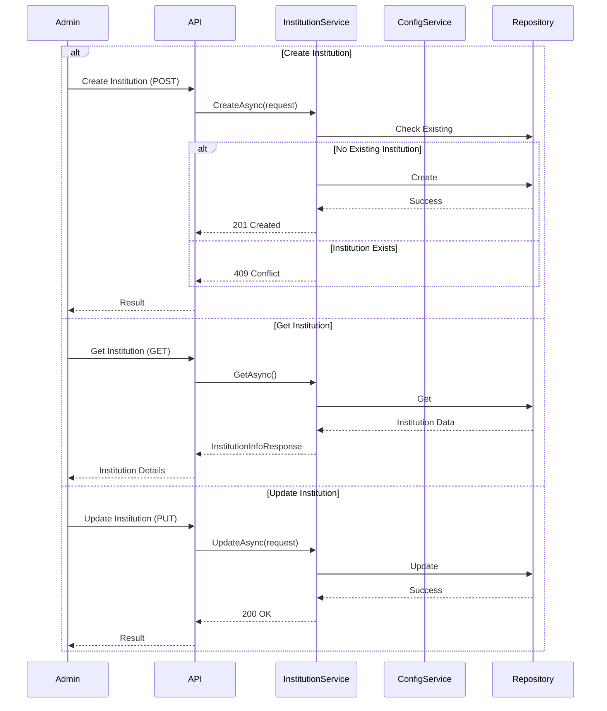
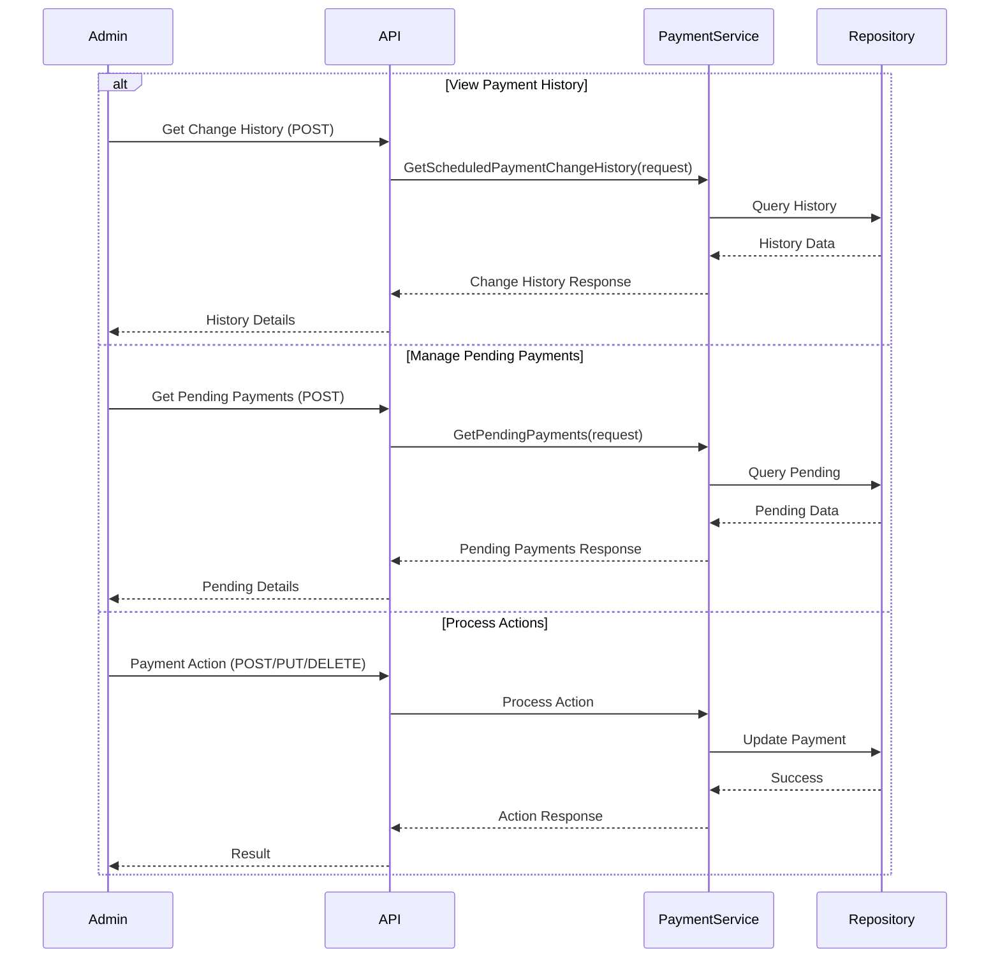
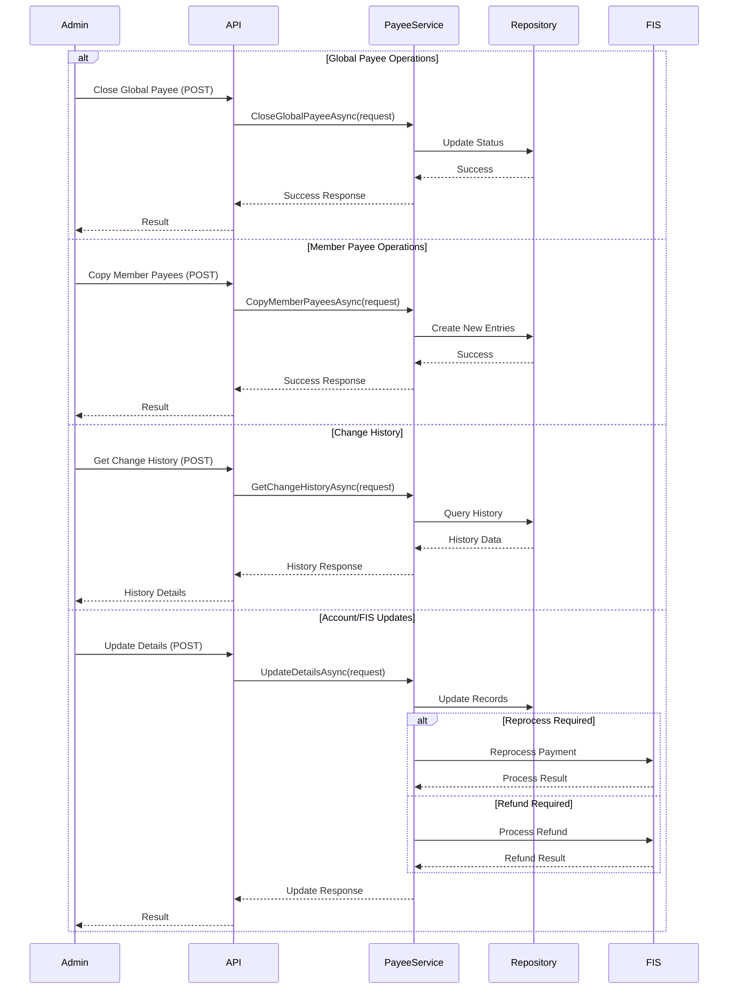

# CBP Admin CU API Admin Workflows

## Overview

This document defines the administrative workflows and processes within the Credit Union Administrative API.

## Institution Management

### Institution Info API
```yaml
institution_workflow:
  name: "Institution Information Management"
  actors: ["CUAdmin"]
  verified_date: "2025-01-03T13:39:11-07:00"
  evidence:
    implementation: 
      - "InstitutionInfoController"
      - "InstitutionInfoService"
    endpoints:
      - "POST /api/v1/institutioninfo"
      - "GET /api/v1/institutioninfo"
      - "PUT /api/v1/institutioninfo"
  
  workflows:
    create_institution:
      endpoint: "POST /api/v1/institutioninfo"
      inputs:
        - "Institution details"
      validation:
        - "No existing record"
        - "Required fields present"
      responses:
        success: "201 Created"
        conflict: "409 Conflict"
        error: "500 Internal Server Error"
    
    get_institution:
      endpoint: "GET /api/v1/institutioninfo"
      outputs:
        - "InstitutionInfoResponse"
      responses:
        success: "200 OK"
        not_found: "400 Bad Request"
        error: "500 Internal Server Error"
    
    update_institution:
      endpoint: "PUT /api/v1/institutioninfo"
      inputs:
        - "Updated institution details"
        - "Institution ID"
      validation:
        - "Valid institution ID"
        - "Required fields present"
      responses:
        success: "200 OK"
        invalid: "400 Bad Request"
        not_found: "404 Not Found"
        error: "500 Internal Server Error"
```

### Configuration API
```yaml
configuration_workflow:
  name: "Configuration Management"
  actors: ["CUAdmin"]
  verified_date: "2025-01-03T13:39:11-07:00"
  evidence:
    implementation: 
      - "ConfigurationController"
      - "ConfigurationService"
    endpoints:
      - "POST /api/v1/configuration"
      - "DELETE /api/v1/configuration/{id}"
      - "GET /api/v1/configuration/{id}"
      - "GET /api/v1/configuration/all"
      - "POST /api/v1/configuration/refresh"
  
  workflows:
    create_configuration:
      endpoint: "POST /api/v1/configuration"
      inputs:
        - "Configuration details"
      validation:
        - "Unique config name"
      responses:
        success: "201 Created"
        conflict: "409 Conflict"
        error: "500 Internal Server Error"
    
    delete_configuration:
      endpoint: "DELETE /api/v1/configuration/{id}"
      inputs:
        - "Configuration ID"
      validation:
        - "Valid configuration ID"
      responses:
        success: "200 OK"
        invalid: "400 Bad Request"
        not_found: "404 Not Found"
        error: "500 Internal Server Error"
    
    get_configuration:
      endpoint: "GET /api/v1/configuration/{id}"
      inputs:
        - "Configuration ID"
      validation:
        - "Valid configuration ID"
      outputs:
        - "ConfigurationResponse"
      responses:
        success: "200 OK"
        invalid: "400 Bad Request"
        not_found: "404 Not Found"
        error: "500 Internal Server Error"
    
    list_configurations:
      endpoint: "GET /api/v1/configuration/all"
      outputs:
        - "ConfigurationListResponse"
      responses:
        success: "200 OK"
        error: "500 Internal Server Error"
    
    refresh_configuration:
      endpoint: "POST /api/v1/configuration/refresh"
      responses:
        success: "200 OK"
        error: "500 Internal Server Error"
```

### Institution Management Flow



## Credit Union Management Workflows

### Implementation Status - Onboarding
```yaml
status:
  name: "Credit Union Onboarding"
  last_verified: "2025-01-03T13:30:56-07:00"
  state: "Needs Implementation Verification"
  findings:
    - "Business rules exist in onboarding_constraints.rules"
    - "No specific onboarding controller implementation found"
    - "Further analysis blocked pending implementation evidence"
```

### Credit Union Configuration
```yaml
configuration_workflow:
  name: "Credit Union Configuration"
  actors: ["CUAdmin"]
  verified_date: "2025-01-03T13:24:22-07:00"
  evidence:
    implementation: 
      - "InstitutionInfoController"
      - "ConfigurationController"
    business_rules: "onboarding_constraints.rules"
  
  workflows:
    institution_setup:
      endpoint: "POST /api/v1/institutioninfo"
      inputs:
        - "Institution details"
      validation:
        - "No existing record"
        - "Admin authorization"
        - "Required fields present"
      constraints:
        - "Must complete within 30 days"
        - "All required settings configured"
    
    configuration_management:
      endpoint: "POST /api/v1/configuration"
      inputs:
        - "Configuration name"
        - "Configuration value"
      validation:
        - "Unique config name"
        - "Admin authorization"
      actions:
        - "Create config"
        - "Update records"
        - "Create audit trail"

    view_institution:
      endpoint: "GET /api/v1/institutioninfo"
      validation:
        - "Admin authorization"
      outputs:
        - "Institution details"
        - "Configuration status"
```

### Operational Settings
```yaml
operational_workflow:
  name: "Operational Settings Management"
  actors: ["CUAdmin"]
  verified_date: "2025-01-03T13:24:22-07:00"
  evidence:
    implementation: "ConfigurationController"
    business_rules: 
      - "operational_limits.rules"
      - "availability_constraints.rules"
  
  workflows:
    update_settings:
      endpoint: "PUT /api/v1/configuration/{id}"
      inputs:
        - "Setting updates"
      validation:
        - "Valid setting ID"
        - "Admin authorization"
        - "Value constraints"
      constraints:
        - rule: "Admin users"
          limit: "Maximum 10 per credit union"
        - rule: "API rate"
          limit: "1000 requests per minute"
        - rule: "Concurrent sessions"
          limit: "5 per user"
      actions:
        - "Validate settings"
        - "Apply updates"
        - "Create audit trail"
    
    delete_settings:
      endpoint: "DELETE /api/v1/configuration/{id}"
      inputs:
        - "Setting ID"
      validation:
        - "Setting exists"
        - "Admin authorization"
        - "Not a required setting"
      actions:
        - "Remove setting"
        - "Update records"
        - "Create audit trail"
```

## Payment Management

### Payment API
```yaml
payment_workflow:
  name: "Payment Management"
  actors: ["CUAdmin"]
  verified_date: "2025-01-03T13:39:11-07:00"
  evidence:
    implementation: 
      - "PaymentController"
      - "PaymentService"
    endpoints:
      - "POST /api/v1/payment/change-history"
      - "POST /api/v1/payment/recurring/change-history"
      - "POST /api/v1/payment/pending"
      - "POST /api/v1/payment/pending-payments"
      - "POST /api/v1/payment/activity"
      - "POST /api/v1/payment/reprocess"
      - "POST /api/v1/payment/confirmation"
      - "POST /api/v1/payment/status"
      - "PUT /api/v1/payment/{paymentId}"
      - "DELETE /api/v1/payment/{paymentId}"
      - "POST /api/v1/payment/cancel-payment-refund"
  
  workflows:
    get_scheduled_changes:
      endpoint: "POST /api/v1/payment/change-history"
      inputs:
        - "Date range"
        - "Search value"
      outputs:
        - "Change history list"
    
    get_recurring_changes:
      endpoint: "POST /api/v1/payment/recurring/change-history"
      inputs:
        - "Date range"
        - "Search value"
      outputs:
        - "Recurring change history"
    
    get_pending_payments:
      endpoint: "POST /api/v1/payment/pending"
      inputs:
        - "Search date"
      outputs:
        - "Pending payments"
        - "Batch information"
    
    search_pending_payments:
      endpoint: "POST /api/v1/payment/pending-payments"
      inputs:
        - "Search criteria"
      outputs:
        - "Pending payment list"
    
    get_payment_activity:
      endpoint: "POST /api/v1/payment/activity"
      inputs:
        - "Activity criteria"
      outputs:
        - "Payment activity list"
    
    reprocess_payment:
      endpoint: "POST /api/v1/payment/reprocess"
      inputs:
        - "Payment ID"
      validation:
        - "Valid payment ID"
      responses:
        success: "200 OK"
        invalid: "400 Bad Request"
        not_found: "404 Not Found"
        error: "500 Internal Server Error"
    
    send_confirmation:
      endpoint: "POST /api/v1/payment/confirmation"
      responses:
        success: "200 OK"
        error: "500 Internal Server Error"
    
    update_status:
      endpoint: "POST /api/v1/payment/status"
      inputs:
        - "Payment ID"
        - "Status code"
      validation:
        - "Valid payment ID"
        - "Valid status code"
      responses:
        success: "200 OK"
        invalid: "400 Bad Request"
        not_found: "404 Not Found"
        error: "500 Internal Server Error"
    
    edit_payment:
      endpoint: "PUT /api/v1/payment/{paymentId}"
      inputs:
        - "Payment ID"
        - "Account details"
        - "Member ID"
        - "Amount"
        - "Process date"
        - "Frequency (recurring)"
        - "Number of payments (recurring)"
      validation:
        - "Valid payment ID"
        - "Required fields present"
      responses:
        success: "200 OK"
        invalid: "400 Bad Request"
        not_found: "404 Not Found"
        error: "500 Internal Server Error"
    
    cancel_payment:
      endpoint: "DELETE /api/v1/payment/{paymentId}"
      inputs:
        - "Payment ID"
      validation:
        - "Valid payment ID"
      responses:
        success: "200 OK"
        invalid: "400 Bad Request"
        not_found: "404 Not Found"
        error: "500 Internal Server Error"
    
    cancel_and_refund:
      endpoint: "POST /api/v1/payment/cancel-payment-refund"
      inputs:
        - "Payment ID"
        - "Exception ID"
      validation:
        - "Valid payment ID"
      responses:
        success: "200 OK"
        invalid: "400 Bad Request"
        not_found: "404 Not Found"
        error: "500 Internal Server Error"
```

### Payment Management Flow



## User Administration Workflows

### Implementation Status
```yaml
status:
  name: "User Administration"
  last_verified: "2025-01-03T13:28:18-07:00"
  state: "Needs Implementation Verification"
  findings:
    - "Business rules exist in admin_permissions.md and business_constraints.md"
    - "No controller implementation found for user administration"
    - "Further analysis blocked pending implementation evidence"
```

## System Administration Workflows

### Implementation Status - System Monitoring
```yaml
status:
  name: "System Monitoring"
  last_verified: "2025-01-03T13:30:56-07:00"
  state: "Needs Implementation Verification"
  findings:
    - "No monitoring controller implementation found"
    - "Further analysis blocked pending implementation evidence"
```

### Processing Window Management

```yaml
window_workflow:
  name: "Processing Window Management"
  actors: ["CUAdmin"]
  
  workflows:
    create_window:
      endpoint: "POST /api/v1/processing/windows"
      inputs:
        - "Window definition"
        - "Schedule details"
      validation:
        - "Overlap check"
        - "Resource check"
    
    modify_window:
      endpoint: "PUT /api/v1/processing/windows/{id}"
      inputs:
        - "Window updates"
        - "Schedule changes"
      validation:
        - "Impact analysis"
        - "Advance notice"
    
    delete_window:
      endpoint: "DELETE /api/v1/processing/windows/{id}"
      inputs:
        - "Deletion reason"
        - "Effective date"
      validation:
        - "Dependency check"
        - "Admin approval"
```

### Implementation Status - Status Management
```yaml
status:
  name: "Status Management"
  last_verified: "2025-01-03T13:30:56-07:00"
  state: "Needs Implementation Verification"
  findings:
    - "No status management controller implementation found"
    - "Further analysis blocked pending implementation evidence"
```

## Calendar Management Workflows

### Holiday Management
```yaml
holiday_workflow:
  name: "Holiday Calendar Management"
  actors: ["CUAdmin"]
  verified_date: "2025-01-03T13:25:05-07:00"
  evidence:
    implementation: "CalendarController"
    business_rules: 
      - "processing_window_constraints.rules"
      - "availability_constraints.rules"
  
  workflows:
    create_holiday:
      endpoint: "POST /api/v1/calendar/holiday"
      inputs:
        - "Holiday date"
        - "Holiday name"
        - "Holiday type"
      validation:
        - "No date conflict"
        - "Admin authorization"
        - "Valid date format"
      constraints:
        - "Must not conflict with processing windows"
        - "Must respect maintenance windows"
      actions:
        - "Create holiday"
        - "Update calendar"
        - "Create audit trail"
    
    update_holiday:
      endpoint: "PUT /api/v1/calendar/holiday"
      inputs:
        - "Holiday ID"
        - "Updated details"
      validation:
        - "Holiday exists"
        - "Admin authorization"
        - "No date conflicts"
      actions:
        - "Update holiday"
        - "Adjust schedules"
        - "Create audit trail"
    
    delete_holiday:
      endpoint: "DELETE /api/v1/calendar/holiday/{holidayId}"
      inputs:
        - "Holiday ID"
      validation:
        - "Holiday exists"
        - "Admin authorization"
        - "No dependent schedules"
      actions:
        - "Remove holiday"
        - "Update calendar"
        - "Create audit trail"
    
    view_holidays:
      endpoint: "GET /api/v1/calendar/holiday/all/{sponsorId}"
      inputs:
        - "Sponsor ID"
      validation:
        - "Admin authorization"
        - "Valid sponsor"
      outputs:
        - "Holiday list"
        - "Calendar impacts"
```

### Processing Window Management
```yaml
processing_window_workflow:
  name: "Processing Window Management"
  actors: ["CUAdmin"]
  verified_date: "2025-01-03T13:25:05-07:00"
  evidence:
    implementation: "CalendarController"
    business_rules: "processing_window_constraints.rules"
  
  constraints:
    window_rules:
      - rule: "Minimum duration"
        value: "1 hour"
        rationale: "Ensure sufficient processing time"
      
      - rule: "Maximum windows per day"
        value: "3 windows"
        rationale: "Prevent excessive cycles"
      
      - rule: "Minimum gap between windows"
        value: "30 minutes"
        rationale: "Allow maintenance"
    
    availability:
      - rule: "System uptime"
        requirement: "99.9% during processing windows"
        measurement: "Monthly"
      
      - rule: "Maintenance scheduling"
        requirement: "Only during non-processing hours"
        exceptions: "Emergency maintenance"
  
  workflows:
    manage_windows:
      validation:
        - "Window duration >= 1 hour"
        - "Max 3 windows per day"
        - "30 minute minimum gap"
        - "No holiday conflicts"
        - "Admin authorization"
      actions:
        - "Validate constraints"
        - "Update schedule"
        - "Create audit trail"
```

## Payment and Payee Management Workflows

### Payment History Management
```yaml
payment_workflow:
  name: "Payment History Management"
  actors: ["CUAdmin"]
  verified_date: "2025-01-03T13:22:06-07:00"
  evidence:
    implementation: "PaymentController.GetScheduledPaymentChangeHistory"
    business_rules: "audit_requirements.events"
  
  workflows:
    scheduled_history:
      endpoint: "POST /api/v1/payment/change-history"
      inputs:
        - "Date range"
        - "Search criteria"
      validation:
        - "Valid date range"
        - "Admin authorization"
      outputs:
        - "Change history records"
        - "Audit trail"
    
    recurring_history:
      endpoint: "POST /api/v1/payment/recurring/change-history"
      inputs:
        - "Date range"
        - "Search criteria"
      validation:
        - "Valid date range"
        - "Admin authorization"
      outputs:
        - "Change history records"
        - "Audit trail"

    pending_payments:
      endpoint: "POST /api/v1/payment/pending"
      inputs:
        - "Search date"
      validation:
        - "Valid date"
        - "Admin authorization"
      outputs:
        - "Pending payments"
        - "Batch information"
```

### Payee Management
```yaml
payee_workflow:
  name: "Payee Management"
  actors: ["CUAdmin"]
  verified_date: "2025-01-03T13:22:06-07:00"
  evidence:
    implementation: "PayeeController"
    business_rules: "operational_limits.rules"
  
  workflows:
    global_closure:
      endpoint: "POST /api/v1/payee/global/close"
      inputs:
        - "FIS Payee ID"
      validation:
        - "Payee exists"
        - "Admin authorization"
        - "No active payments"
      actions:
        - "Close payee"
        - "Update records"
        - "Create audit trail"
    
    copy_member_payees:
      endpoint: "POST /api/v1/payee/copy-payees"
      inputs:
        - "Member ID"
        - "New Member ID"
      validation:
        - "Source member exists"
        - "Admin authorization"
      actions:
        - "Copy payee data"
        - "Create new entries"
        - "Create audit trail"
```

## Exception Management Workflows

### Exception Management
```yaml
exception_workflow:
  name: "Exception Management"
  actors: ["CUAdmin"]
  verified_date: "2025-01-03T13:22:52-07:00"
  evidence:
    implementation: "ExceptionController"
    business_rules: "data_retention_constraints.rules"
  
  workflows:
    view_exceptions:
      endpoint: "GET /api/v1/exception/{date}"
      inputs:
        - "Date"
      validation:
        - "Valid date format"
        - "Admin authorization"
      outputs:
        - "Payment exceptions"
        - "Exception details"
    
    process_refund:
      endpoint: "POST /api/v1/exception/refund"
      inputs:
        - "Exception ID"
        - "Payment ID"
      validation:
        - "Valid exception"
        - "Admin authorization"
        - "Refund eligibility"
      actions:
        - "Process refund"
        - "Update records"
        - "Create audit trail"
```

## Report Generation Workflows

### Reporting
```yaml
reporting_workflow:
  name: "Report Generation"
  actors: ["CUAdmin"]
  verified_date: "2025-01-03T13:30:56-07:00"
  evidence:
    implementation: "ReportController"
  
  workflows:
    run_report:
      endpoint: "POST /api/v1/report/run"
      inputs:
        - "Report name"
        - "Report arguments"
      validation:
        - "Valid report name"
        - "Admin authorization"
      outputs:
        - "Report data (JSON)"
```

### Implementation Status - Report Scheduling
```yaml
status:
  name: "Report Scheduling"
  last_verified: "2025-01-03T13:30:56-07:00"
  state: "Needs Implementation Verification"
  findings:
    - "No scheduling controller implementation found"
    - "Further analysis blocked pending implementation evidence"
```

## Monitoring and Reporting Workflows

### Reporting

```yaml
reporting_workflow:
  name: "Reporting"
  actors: ["CUAdmin", "CUOperator"]
  
  workflows:
    generate_report:
      endpoint: "POST /api/v1/reports"
      inputs:
        - "Report type"
        - "Parameters"
      validation:
        - "Permission check"
        - "Data availability"
    
    schedule_report:
      endpoint: "POST /api/v1/reports/schedule"
      inputs:
        - "Schedule details"
        - "Distribution list"
      validation:
        - "Schedule validity"
        - "Recipient permissions"
```

## Run Management

### Processing Run Operations
```yaml
run_workflow:
  name: "Processing Run Management"
  actors: ["CUAdmin"]
  verified_date: "2025-01-03T13:29:15-07:00"
  evidence:
    implementation: "RunController"
  
  workflows:
    create_manual_run:
      endpoint: "POST /api/v1/run/manual"
      inputs:
        - "Process date"
      validation:
        - "Valid process date"
        - "Admin authorization"
      actions:
        - "Create run"
        - "Queue for processing"
        - "Create audit trail"
```

## Search Management

### Search Operations
```yaml
search_workflow:
  name: "Search Operations"
  actors: ["CUAdmin"]
  verified_date: "2025-01-03T13:29:15-07:00"
  evidence:
    implementation: "SearchController"
  
  workflows:
    search_payment_history:
      endpoint: "POST /api/v1/search/payment-history"
      inputs:
        - "Search type"
        - "Search value"
      validation:
        - "Valid search type"
        - "Admin authorization"
      outputs:
        - "Payment history matches"
    
    search_payments:
      endpoint: "POST /api/v1/search/payment"
      inputs:
        - "Search type"
        - "Search value"
      validation:
        - "Valid search type"
        - "Admin authorization"
      outputs:
        - "Payment matches"
```

## On-Us Payment Management

### On-Us Operations
```yaml
onus_workflow:
  name: "On-Us Payment Operations"
  actors: ["CUAdmin"]
  verified_date: "2025-01-03T13:29:15-07:00"
  evidence:
    implementation: "OnUsController"
  
  workflows:
    view_payment:
      endpoint: "GET /api/v1/onus/payment/{id}"
      inputs:
        - "Payment ID"
      validation:
        - "Valid payment ID"
        - "Admin authorization"
      outputs:
        - "Payment details"
    
    repost_payment:
      endpoint: "PUT /api/v1/onus/payment/repost"
      inputs:
        - "Payment ID"
        - "Loan ID"
      validation:
        - "Valid payment"
        - "Valid loan"
        - "Admin authorization"
      actions:
        - "Update payment"
        - "Create audit trail"
```

## Contact and Customer Management

### Contact Management
```yaml
contact_workflow:
  name: "Contact Management"
  actors: ["CUAdmin"]
  verified_date: "2025-01-03T13:29:15-07:00"
  evidence:
    implementation: "ContactController"
  
  workflows:
    create_contact:
      endpoint: "POST /api/v1/contact"
      inputs:
        - "Contact details"
      validation:
        - "No duplicate contact"
        - "Admin authorization"
      actions:
        - "Create contact"
        - "Create audit trail"
    
    delete_contact:
      endpoint: "DELETE /api/v1/contact/{id}"
      inputs:
        - "Contact ID"
      validation:
        - "Contact exists"
        - "Admin authorization"
      actions:
        - "Remove contact"
        - "Update records"
```

### Customer Management
```yaml
customer_workflow:
  name: "Customer Management"
  actors: ["CUAdmin"]
  verified_date: "2025-01-03T13:29:15-07:00"
  evidence:
    implementation: "CustomerController"
  
  workflows:
    create_customer:
      endpoint: "POST /api/v1/customer"
      inputs:
        - "Customer details"
      validation:
        - "Admin authorization"
      actions:
        - "Create customer"
        - "Create audit trail"
```

## Notification Management

### System Notifications
```yaml
notification_workflow:
  name: "Notification Management"
  actors: ["CUAdmin"]
  verified_date: "2025-01-03T13:29:15-07:00"
  evidence:
    implementation: "NotificationController"
  
  workflows:
    create_notification:
      endpoint: "POST /api/v1/notification"
      inputs:
        - "Message subject"
        - "Message body"
      validation:
        - "Required fields present"
        - "No duplicate notifications"
        - "Admin authorization"
      actions:
        - "Create notification"
        - "Distribute to recipients"
    
    clear_notifications:
      endpoint: "POST /api/v1/notification/saved/clear"
      inputs:
        - "Clear up to date"
      validation:
        - "Valid date"
        - "Admin authorization"
      actions:
        - "Clear notifications"
        - "Update records"
```

## Status Code Management

### Status Code Management
```yaml
status_code_workflow:
  name: "Status Code Management"
  actors: ["CUAdmin"]
  verified_date: "2025-01-03T13:25:46-07:00"
  evidence:
    implementation: "StatusCodeController"
    business_rules: 
      - "data_quality_constraints.rules"
      - "data_retention_constraints.rules"
  
  workflows:
    view_status_code:
      endpoint: "GET /api/v1/statuscode/{code}"
      inputs:
        - "Status code"
      validation:
        - "Valid code format"
        - "Admin authorization"
      outputs:
        - "Status code details"
        - "Status description"
        - "Associated rules"
    
    list_status_codes:
      endpoint: "GET /api/v1/statuscode/all"
      validation:
        - "Admin authorization"
      outputs:
        - "Complete status code list"
        - "Code descriptions"
        - "Usage contexts"
  
  data_quality:
    validation:
      - "All status codes must be documented"
      - "Status transitions must be defined"
      - "Descriptions must be clear and actionable"
    
    retention:
      - rule: "Status change history"
        period: "7 years"
        format: "Tamper-evident logging"
      
      - rule: "Status usage metrics"
        period: "2 years"
        format: "Searchable archives"
```

## Payee Management

### Payee API
```yaml
payee_workflow:
  name: "Payee Management"
  actors: ["CUAdmin"]
  verified_date: "2025-01-03T13:39:11-07:00"
  evidence:
    implementation: 
      - "PayeeController"
      - "PayeeService"
    endpoints:
      - "POST /api/v1/payee/global/close"
      - "POST /api/v1/payee/copy-payees"
      - "POST /api/v1/payee/user/change-history"
      - "POST /api/v1/payee/global/change-history"
      - "POST /api/v1/payee/user/account-number"
      - "POST /api/v1/payee/account-number-reprocess"
      - "POST /api/v1/payee/account-number-refund"
      - "POST /api/v1/payee/user/fis-payee-id"
      - "POST /api/v1/payee/user/fis-payee-refund"
      - "POST /api/v1/payee/manual-exception-reprocess"
  
  workflows:
    close_global_payee:
      endpoint: "POST /api/v1/payee/global/close"
      inputs:
        - "FIS Payee ID"
      validation:
        - "Valid FIS payee ID"
      responses:
        success: "200 OK"
        invalid: "400 Bad Request"
        not_found: "404 Not Found"
        error: "500 Internal Server Error"
    
    copy_member_payees:
      endpoint: "POST /api/v1/payee/copy-payees"
      inputs:
        - "Member ID"
        - "New Member ID"
      validation:
        - "Valid member IDs"
      responses:
        success: "200 OK"
        invalid: "400 Bad Request"
        not_found: "404 Not Found"
        error: "500 Internal Server Error"
    
    user_payee_history:
      endpoint: "POST /api/v1/payee/user/change-history"
      inputs:
        - "Report parameters"
      outputs:
        - "UserPayeeChangeHistoryListResponse"
      responses:
        success: "200 OK"
        invalid: "400 Bad Request"
        error: "500 Internal Server Error"
    
    global_payee_history:
      endpoint: "POST /api/v1/payee/global/change-history"
      inputs:
        - "Report parameters"
      outputs:
        - "GlobalPayeeChangeHistoryListResponse"
      responses:
        success: "200 OK"
        invalid: "400 Bad Request"
        error: "500 Internal Server Error"
    
    update_account_number:
      endpoint: "POST /api/v1/payee/user/account-number"
      inputs:
        - "User payee list ID"
        - "Account number"
      validation:
        - "Valid user payee ID"
        - "Valid account number"
      responses:
        success: "200 OK"
        invalid: "400 Bad Request"
        not_found: "404 Not Found"
        error: "500 Internal Server Error"
    
    update_account_reprocess:
      endpoint: "POST /api/v1/payee/account-number-reprocess"
      inputs:
        - "User payee list ID"
        - "Account number"
      validation:
        - "Valid user payee ID"
        - "Valid account number"
      responses:
        success: "200 OK"
        invalid: "400 Bad Request"
        not_found: "404 Not Found"
        error: "500 Internal Server Error"
    
    update_account_refund:
      endpoint: "POST /api/v1/payee/account-number-refund"
      inputs:
        - "User payee list ID"
        - "Account number"
      validation:
        - "Valid user payee ID"
        - "Valid account number"
      responses:
        success: "200 OK"
        invalid: "400 Bad Request"
        not_found: "404 Not Found"
        error: "500 Internal Server Error"
    
    update_fis_payee:
      endpoint: "POST /api/v1/payee/user/fis-payee-id"
      inputs:
        - "User payee list ID"
        - "FIS payee ID"
      validation:
        - "Valid user payee ID"
        - "Valid FIS payee ID"
      responses:
        success: "200 OK"
        invalid: "400 Bad Request"
        not_found: "404 Not Found"
        error: "500 Internal Server Error"
    
    update_fis_payee_refund:
      endpoint: "POST /api/v1/payee/user/fis-payee-refund"
      inputs:
        - "User payee list ID"
        - "FIS payee ID"
      validation:
        - "Valid user payee ID"
        - "Valid FIS payee ID"
      responses:
        success: "200 OK"
        invalid: "400 Bad Request"
        not_found: "404 Not Found"
        error: "500 Internal Server Error"
    
    manual_exception_reprocess:
      endpoint: "POST /api/v1/payee/manual-exception-reprocess"
      responses:
        success: "200 OK"
        invalid: "400 Bad Request"
        not_found: "404 Not Found"
        error: "500 Internal Server Error"
```

### Payee Management Flow



## References

- API Specification: `api.json`
- Implementation: `cbp.admin-cu-api/`
- Related Systems: `cbp.admin-api/`
