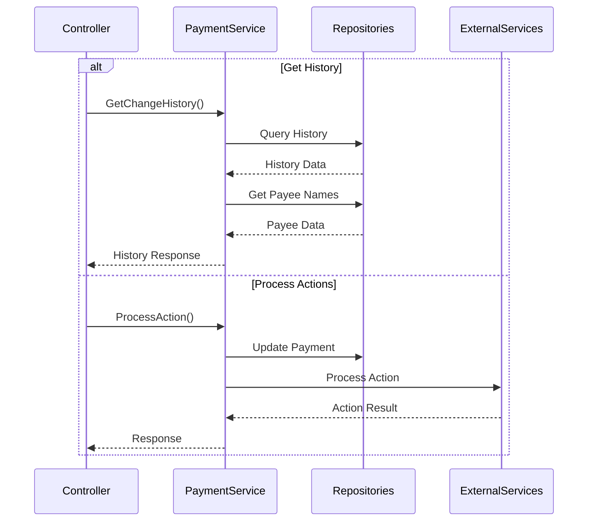

# CBP Admin CU API State Transitions

## Overview

This document defines the verified state transitions within the Credit Union Administrative API based on the actual implementation in PaymentService.cs and related components.

## Payment Management

### Payment Operations
```yaml
payment_operations:
  verified_operations:
    get_payment_activity:
      endpoint: "GetPaymentActivity"
      implementation: "PaymentService.GetPaymentActivity"
      inputs:
        - "PaymentActivityRequest"
      outputs:
        - "PaymentActivityListResponse"
    
    get_pending_payments:
      endpoint: "GetPendingPayments"
      implementation: "PaymentService.GetPendingPayments"
      inputs:
        - "PendingPaymentsRequest"
      outputs:
        - "PendingPaymentListResponse"
    
    get_recurring_history:
      endpoint: "GetRecurringPaymentChangeHistory"
      implementation: "PaymentService.GetRecurringPaymentChangeHistory"
      inputs:
        - "RecurringPaymentChangeHistoryReportRequest"
      outputs:
        - "RecurringPaymentChangeHistoryListResponse"
    
    get_scheduled_history:
      endpoint: "GetScheduledPaymentChangeHistory"
      implementation: "PaymentService.GetScheduledPaymentChangeHistory"
      inputs:
        - "ScheduledPaymentChangeHistoryReportRequest"
      outputs:
        - "ScheduledPaymentChangeHistoryListResponse"
    
    reprocess_payment:
      endpoint: "ReprocessAsync"
      implementation: "PaymentService.ReprocessAsync"
      inputs:
        - "PaymentReprocessRequest"
      outputs:
        - "ServiceResponse"
    
    update_status:
      endpoint: "UpdateStatusAsync"
      implementation: "PaymentService.UpdateStatusAsync"
      inputs:
        - "PaymentUpdateStatusRequest"
      outputs:
        - "ServiceResponse"
    
    edit_payment:
      endpoint: "EditPayment"
      implementation: "PaymentService.EditPayment"
      inputs:
        - "paymentId: string"
        - "PaymentEditRequest"
      outputs:
        - "ServiceResponse"
    
    cancel_payment:
      endpoint: "CancelPayment"
      implementation: "PaymentService.CancelPayment"
      inputs:
        - "paymentId: string"
        - "statusCode: int (default: 103)"
      outputs:
        - "ServiceResponse"
    
    cancel_and_refund:
      endpoint: "CancelPaymentAndRefund"
      implementation: "PaymentService.CancelPaymentAndRefund"
      inputs:
        - "CancelPaymentAndRefundRequest"
      outputs:
        - "ServiceResponse"

  dependencies:
    repositories:
      - "ICuGenericRepository<Payment>"
      - "IWarehouseGenericRepository<GlobalPayee>"
      - "ICuGenericRepository<InstitutionInfo>"
      - "IWarehouseGenericRepository<Holiday>"
      - "ICuGenericRepository<UserPayeeList>"
      - "ICuGenericRepository<CustomerInfo>"
      - "ICuGenericRepository<PersonalPayee>"
    
    services:
      - "IExceptionService"
      - "ICalendarProvider"
      - "INotificationProvider"
```

### Flow Diagram



## References

- Implementation: `Services/Implementation/PaymentService.cs`
- Interface: `Services/Abstract/IPaymentService.cs`
- Dependencies: See `payment_operations.dependencies`
