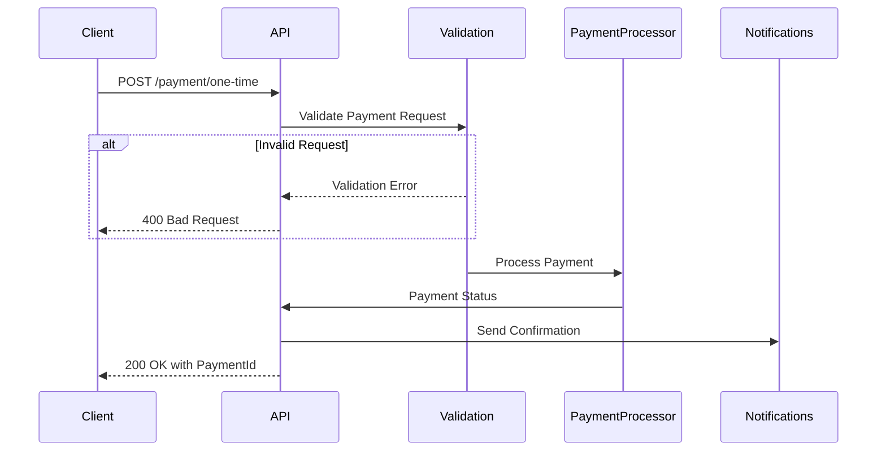
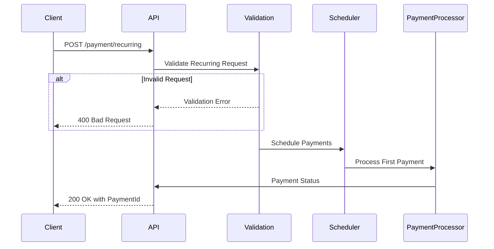
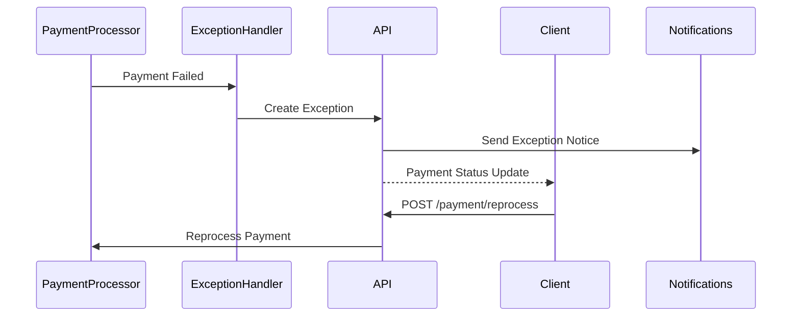
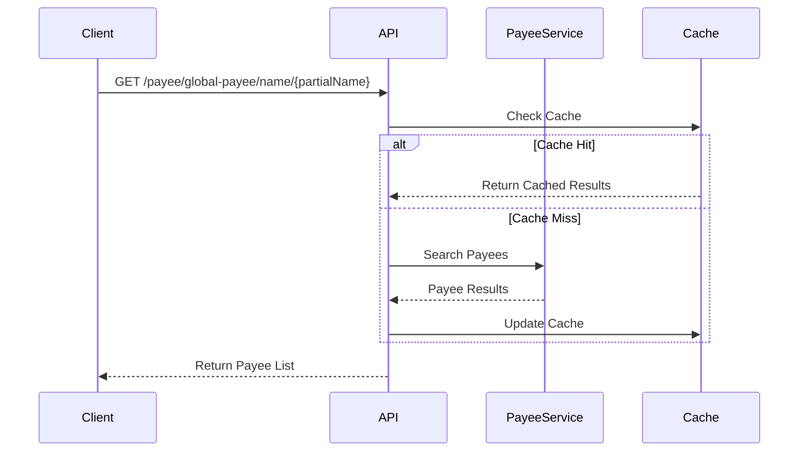
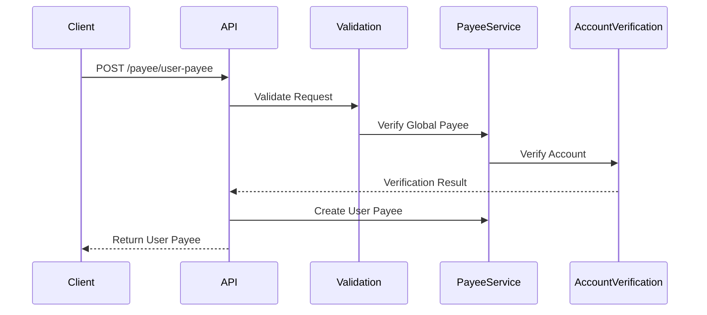
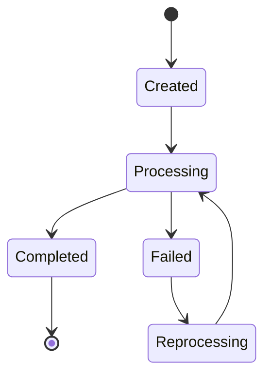
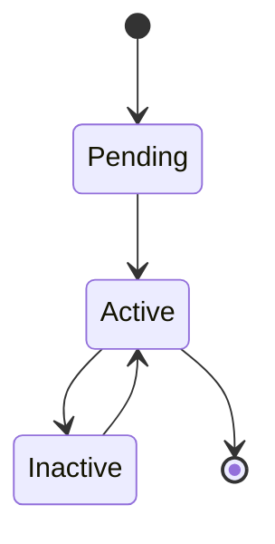

# CBP API Transaction Flows

## Overview

This document maps both implemented and planned transaction flows in the CBP API.

## Currently Implemented Flows

### One-Time Payment Flow


### Recurring Payment Flow


### Payment Exception Flow


### Global Payee Search Flow


### User Payee Creation Flow


## State Transitions

### Payment States


### Payee States


## Process Components

### Payment Processing Components
1. Request Validation
   - Input validation
   - Business rule validation
   - Duplicate detection

2. Payment Processing
   - Amount verification
   - Account validation
   - Processing scheduling
   - Status tracking

3. Exception Handling
   - Error detection
   - Notification generation
   - Reprocessing management
   - Audit logging

### Payee Management Components
1. Payee Search
   - Name matching
   - Result caching
   - Response formatting

2. Payee Creation
   - Global payee verification
   - Account validation
   - User association
   - Status management

## Integration Points

### External Systems
1. Payment Processor
   - Payment submission
   - Status updates
   - Exception handling

2. Account Verification
   - Account validation
   - Status checks
   - Update processing

3. Notification System
   - Exception notifications
   - Status updates
   - Confirmation messages

## Error Handling

### Recovery Flows
1. Payment Failures
   - Exception creation
   - Notification dispatch
   - Reprocessing initiation
   - Status tracking

2. Validation Failures
   - Error response
   - Logging
   - Monitoring
   - Client feedback

## Missing Critical Flows

### Transaction Reconciliation Flow
```yaml
documented_rules:
  reconciliation:
    rule: "Transaction reconciliation flow"
    verification_status: not_found
    expected_steps:
      - Match transactions
      - Resolve discrepancies
      - Update status
    impact: "No reconciliation"
```

### Risk Management Flow
```yaml
documented_rules:
  risk_management:
    rule: "Risk management flow"
    verification_status: partial
    expected_steps:
      - Risk assessment
      - Fraud detection
      - Action triggers
    impact: "Limited risk management"
```

### Compliance Flow
```yaml
documented_rules:
  compliance:
    rule: "Compliance management flow"
    verification_status: not_found
    expected_steps:
      - Rule validation
      - Report generation
      - Audit tracking
    impact: "No compliance tracking"
```

## Implementation Notes

1. Current Implementation Status:
   - Basic payment flows implemented
   - Simple recurring flows implemented
   - Limited payee flows implemented
   - Basic error handling implemented
   - Basic notifications implemented

2. Missing Critical Components:
   - No reconciliation flow
   - Limited risk management
   - No compliance flow
   - Basic error tracking

3. Implementation Gaps:
   - Incomplete flows
   - Basic error handling
   - Limited monitoring
   - Simple notifications

4. Risk Assessment:
   - Missing critical flows
   - Limited flow tracking
   - Basic monitoring
   - Simple error handling

## References

- API Specification: `api.json`
- Implementation: `cbp.api/`
- Validation Rules: See `validation_rules.md`
- Domain Models: See `domain_models.md`
