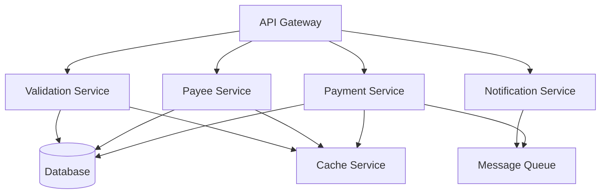
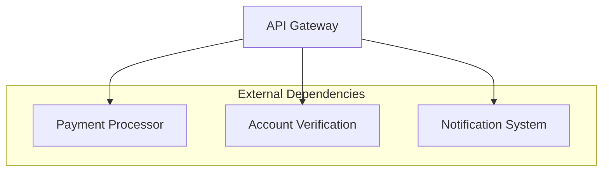

# CBP API Dependency Map

## Overview

This document maps the dependencies and integration points in the CBP API, focusing on system components, external services, and their relationships.

## Core Dependencies

### System Components


### External Services


## Service Dependencies

### Payment Processing
```yaml
service: Payment Service
dependencies:
  internal:
    required:
      - Validation Service
      - Database
      - Message Queue
    optional:
      - Cache Service
  external:
    required:
      - Payment Processor
    optional:
      - Notification System
  libraries:
    - Transaction management
    - State machine
    - Error handling
```

### Payee Management
```yaml
service: Payee Service
dependencies:
  internal:
    required:
      - Validation Service
      - Database
    optional:
      - Cache Service
  external:
    required:
      - Account Verification
    optional:
      - Notification System
  libraries:
    - Data validation
    - Search functionality
    - Cache management
```

## Infrastructure Dependencies

### Runtime Environment
```yaml
environment:
  required:
    - JVM/Runtime version
    - Memory allocation
    - CPU resources
  optional:
    - GPU acceleration
    - Network optimization
  monitoring:
    - Resource metrics
    - Performance stats
```

### Data Storage
```yaml
storage:
  primary:
    type: Relational Database
    requirements:
      - ACID compliance
      - Transaction support
      - Backup capability
  cache:
    type: Distributed Cache
    requirements:
      - High availability
      - Fast access
      - Data consistency
```

## Integration Dependencies

### API Integration
```yaml
integrations:
  payment_processor:
    type: REST API
    requirements:
      - Authentication
      - Rate limiting
      - Timeout handling
    dependencies:
      - SSL certificates
      - API credentials
      - Network access

  account_verification:
    type: SOAP/REST API
    requirements:
      - Secure channel
      - Response validation
      - Error handling
    dependencies:
      - Service credentials
      - Protocol support
      - Network access
```

### Message Queue
```yaml
messaging:
  system:
    type: Message Broker
    requirements:
      - Guaranteed delivery
      - Order preservation
      - Dead letter handling
    dependencies:
      - Queue manager
      - Storage system
      - Network access
```

## Library Dependencies

### Core Libraries
```yaml
libraries:
  runtime:
    - Framework version
    - Core utilities
    - Common libraries
  security:
    - Encryption
    - Authentication
    - Authorization
  persistence:
    - ORM framework
    - Connection pooling
    - Cache client
```

### Optional Libraries
```yaml
libraries:
  monitoring:
    - Metrics collection
    - Log aggregation
    - Tracing support
  utilities:
    - Date/time handling
    - String manipulation
    - JSON processing
```

## Configuration Dependencies

### System Configuration
```yaml
configuration:
  required:
    - Environment variables
    - Property files
    - Security settings
  optional:
    - Feature flags
    - Debug settings
    - Performance tuning
```

### Service Configuration
```yaml
configuration:
  services:
    - Endpoint URLs
    - Credentials
    - Timeout settings
  resources:
    - Connection pools
    - Thread pools
    - Cache settings
```

## Deployment Dependencies

### Container Dependencies
```yaml
containers:
  runtime:
    - Base image
    - System libraries
    - Runtime tools
  networking:
    - Service discovery
    - Load balancing
    - Health checks
```

### Infrastructure Dependencies
```yaml
infrastructure:
  required:
    - Load balancer
    - Service mesh
    - Monitoring system
  optional:
    - CDN
    - Rate limiter
    - API gateway
```

## Dependency Management

### Version Management
```yaml
versioning:
  strategy:
    - Semantic versioning
    - Compatibility matrix
    - Update schedule
  tracking:
    - Version catalog
    - Dependency tree
    - Update history
```

### Dependency Monitoring
```yaml
monitoring:
  checks:
    - Version updates
    - Security patches
    - Compatibility issues
  alerts:
    - Critical updates
    - Security vulnerabilities
    - Breaking changes
```

## References

- API Specification: `api.json`
- Implementation: `cbp.api/`
- Integration Patterns: See `integration_patterns.md`
- Complexity Analysis: See `complexity_analysis.md`
